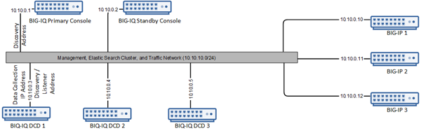

LAB 7 BIG-IQ DNS Sync Group Administration
==========================================

Goal:

In this lab, we will demonstrate how to manage the major DNS components
on the managed BIG-IP devices from BIG-IQ CM perspective. We will
**not** demonstrate the management of DNS application configuration
objects such as WideIP, Pool or Servers.

When you use F5® BIG-IQ® Centralized Management to manage your DNS sync
groups, the task becomes quite straightforward. You can do a quick
health check, diagnose health issues, and even set up an alert to notify
you if a sync group health issue occurs. You can view the DNS listeners
configured for the DNS sync groups you manage. You can view and modify
the properties for existing DNS profiles. You can also manage
permissions for DNS GSLB objects.

Tasks:

7.1: Check DNS Sync Group Health

7.2: Managing DNS Profiles

7.3: Managing DNS Listeners

7.4: Managing permissions for GSLB Objects

Task 7.1: Check DNS Sync Group Health
~~~~~~~~~~~~~~~~~~~~~~~~~~~~~~~~~~~~~

Before you can monitor the sync group health, you must add a BIG-IP
device configured in a DNS sync group to the BIG-IP Devices inventory
list, and import the LTM and DNS services. For the purpose of this lab,
the sync group on BIG-IP DNS devices are already properly configured.

When you use F5 BIG-IQ Centralized Management to manage your DNS sync
group, you can monitor the health status of the group. Sync group health
relies on complete alignment of a variety of device configuration
elements. Using BIG-IQ simplifies the process of determining the health
of your DNS sync groups.

1. At the top of the screen, click Devices.

2. On the left, click BIG-IP CLUSTERS > DNS Sync Groups.

    The screen displays the list of DNS sync groups defined on this
    device. A health indicator icon and a message describe the status of
    each group.

    |image0|

1. To view the general properties for a sync group, click the sync group
   name.

    |image1|

    The screen displays the properties for the selected group. This
    screen shows an overview of your DNS sync group health. Under
    Status, you can see the current state (for example, Required
    Services Down, or Health Check(s) Passed) for each device in the
    group.

1. To view the health for an individual sync group member, on the left
   click HEALTH.

    |image2|

    The Health screen displays detailed information for each factor that
    contributes to the health of a DNS sync group. Following a
    definition of each factor, a Status row provides additional detail.

    For each indicator, the most serious issues impacting that indicator
    are listed first. Finally, if the status for a health indicator is
    not Health Check(s) Passed, the Recommended Action setting describes
    what you can do to correct the issue.

1. Now, we will introduce a problem in the DNS Sync Group to see how
   that appears in BIG-IQ.

   Log into the command line of BOS-vBIGIP01 and run the following
   command.

   |image3|

2. Return to the BIG-IQ GUI and select the status check box and then
   click the Refresh Status button to force a refresh.

   |image4|

3. Review the Status for the sync group(s). (This may take a minute for
   it to show down)

   |image5|

4. Click on the DNS Sync Group name to get more information

   |image6|

5. Review the Properties of the DNS Sync Group\ |image7|

6. Click on the Health tab to get further information. Scroll down to
   find the problem. |image8|

7. Return to the shell for BIG-IP01 and restart gtmd. |image9|

8. Return to the BIG-IQ GUI and verify that all indicators have returned
   to green. (Again, this may take a minute or two)\ |image10|

Task 7.2: Managing DNS Profiles
~~~~~~~~~~~~~~~~~~~~~~~~~~~~~~~

A DNS profile allows you to configure various DNS attributes that a
virtual server or DNS listener object applies to DNS traffic. For
example, when you enable the DNS Express feature in the DNS profile, the
BIG-IP system acts as an authoritative secondary DNS server, and
performs actions such as zone transfers from multiple primary DNS
servers or zone transfers from the local BIND server on the BIG-IP
system.

You can view the DNS listeners configured for the DNS sync groups you
manage by navigating to Configuration > DNS > Delivery > Profiles. From
there, click a listener to edit it, click create to setup a new one.

**Create a DNS profile**

You create a profile to configure various DNS attributes that a virtual
server or DNS listener object can apply to DNS traffic.

1. At the top of the screen, click Configuration, then, on the left,
   click DNS > Delivery > Profiles.

    The screen displays the list of profiles defined on this device.

1. Click Create.

    The New Profile screen opens.

1. Type a Name for the DNS profile: **mydnsprofile**

2. Select a Parent Profile from which this profile inherits settings:
   **/Common/dns**

3. Select the options you want to override from the parent DNS profile.

    The options perform the same function as they do on a BIG-IP device.

1. Click Save & Close.

    |image11|

    The system creates the new profile you specified and adds it to the
    list of profiles.

**Edit a DNS profile**

You can view and modify the properties for existing DNS profiles. Since
you are working with an existing profile, you can modify only some
settings.

1. At the top of the screen, click Configuration, then, on the left,
   click DNS > Delivery > Profiles.

    The screen displays the list of profiles defined on this device.

1. Click the name of the profile you want to edit: **mydnsprofile**

    The screen displays the current settings for the selected profile.

1. Make the changes to the settings you want to revise.

    Under DNS Features, check the **Use BIND Server on BIG-IP**, and
    select **Disabled**.

    |image12|

1. when your edits are complete, click Save & Close.

    Note: When you edit a default profile, you cannot override the
    parent profile settings, because default profiles do not have a
    parent.

    The system updates the profile with the settings you specified.

Task 7.3: Managing DNS Listeners
~~~~~~~~~~~~~~~~~~~~~~~~~~~~~~~~

A \ *listener* is a specialized virtual server that passively checks for
DNS packets on port 53 and the IP address you assign to the listener.
When a DNS query is sent to the IP address of the listener, BIG-IP DNS
either handles the request locally or forwards the request to the
appropriate resource.

You can view the DNS listeners configured for the DNS sync groups you
manage by navigating to Configuration > DNS > Delivery > Listeners.

From there, click a listener to edit it, click Create to set up a new
one.

**Edit a DNS listener**

You can view and modify the properties for existing DNS listeners. Since
you are working with an existing listener, you can modify only some
settings.

1. At the top of the screen, click Configuration, then, on the left,
   click DNS > Delivery > Listeners.

    The screen displays the list of listeners defined on this device.

    |image13|

1. Click the name of the listener you want to edit.

    The screen displays the current settings for the selected listener.

    |image14|

1. Make the changes to the settings you want to revise. Change VLAN
   Traffic from All VLANs to Enabled on /Common/External, and then, when
   your edits are complete, click Save & Close.

    |image15|

    The system updates the listener with the settings you specified.

**Create a DNS listener**

Before you create a DNS listener, make sure you have a pool of DNS
servers.

You can configure a listener that alerts BIG-IP DNS to DNS queries
destined for a pool of DNS servers. The best practice is to create four
listeners: one with an IPv4 address that handles UDP traffic, and one
with the same IPv4 address that handles TCP traffic; one with an IPv6
address that handles UDP traffic, and one with the same IPv6 address
that handles TCP traffic.

1. At the top of the screen, click Configuration, then, on the left,
   click DNS > Delivery > Listeners.

    The screen displays the list of listeners defined on this device.

1. Click Create.

    The New Listener screen opens.

1. Type a Name for the DNS listener: **my-listener-udp**

2. Select a BIG-IP Device on which the DNS listener will run:
   **SEA-vBIGIP01.termmarc.com**

3. In the Listener area, type the IP Address on which the BIG-IP system
   listens for connections: **10.1.10.204**

    The BIG-IP system receives traffic sent to this IP address and
    processes it as needed.

    |image16|

1. Scroll down to the Service area and select the DNS Profile that
   defines how the listener handles DNS traffic: **mydnsprofile.**

    |image17|

    The options are a list of system-supplied and user-defined DNS
    profiles.

1. Specify any additional settings needed to suit the requirements for
   this listener.

    Name, Device, Address, and DNS Profile are the only required
    parameters when you create a listener. The remaining parameters on
    this screen are optional and perform the same function as they do
    when you configure a listener on a BIG-IP device.

1. Click Save & Close.

    The system creates the new listener you specified and adds it to the
    list of listeners.

1. Create another listener with the same IPv4 address and configuration,
   but select TCP from the Protocol list.

    | Name: **my-listener-tcp**
    | BIG-IP Device: **SEA-vBIGIP01.termmarc.com
      **\ IP Address: **10.1.10.204
      **\ DNS Profile: **mydnsprofile**

When you finish that, the BIG-IP device for which you created these
listeners will be able to receive DNS queries, handle wide IP requests,
and forward all other DNS queries to members of the pool of DNS servers.

|image18|

Task 7.4: Managing permissions for GSLB Objects
~~~~~~~~~~~~~~~~~~~~~~~~~~~~~~~~~~~~~~~~~~~~~~~

**View GSLB objects**

When you use F5 BIG-IQ Centralized Management to manage your DNS sync
group, you can view the GSLB objects that are defined on devices in the
sync group.

1. At the top of the screen, click Configuration.

2. On the left, click DNS > GSLB, and then select the object type that
   you want to view.

    |image19|

    The screen displays a list of the selected object type that are
    defined on devices managed by this BIG-IQ system. For each object
    (except topology records or topology regions), icons describe the
    health status and availability.

1. To view overview information about a particular object, select the
   check box for that object.

    An overview panel and a related items panel display for this object.

    |image20|

1. To see a list of related items for a GSLB object:

   a. Select the check box for that object.

   b. In the Related Items panel, click Show.

    |image21|

    You can view the list of related items; and, for many of the items,
    you can click on a link to view properties for that item.

1. To view the general properties for a GSLB object, click the name of
   that object.

    The screen displays the properties for the selected object.

|image22|

**Managing permissions for GSLB Objects**

F5® BIG-IQ® Centralized Management makes it straightforward for you to
manage permissions that allow users to view GSLB objects only for the
specific DNS GSLB objects you assign to them.

To provide permissions for a specific set of objects, you perform the
following tasks.

1. **Add a custom resource group** - You can specify the GSLB objects
   that you want this user to work with. You create a resource group for
   each collection of objects that you want to assign to a user.

    **Refer to Lab 4 Role Management** – Task 4.2 for details of this
    capability.

1. **Add a custom role** - Next, you associate the GSLB Viewer role type
   with the resource groups that contain the objects you want your
   delegates to view. For example, if you had a resource group made up
   of two wide IPs, one named SeattlePrime and the other
   named SeattleSecond you might name this role viewSeattle.

    **Refer to Lab 4 Role Management** – Task 4.3 for details of this
    capability.

1. **Add a custom user** - Finally, you create a user and assign a
   custom role to that user. The role gives that user permissions to
   view the objects that belong to the objects in the resource group. In
   the previous example, you could assign your custom user to
   the viewSeattle role to give that user the ability to view the GSLB
   objects in the two Seattle wide IPs.

    **Refer to Lab 4 Role Management** – Task 4.4 for details of this
    capability.

.. |image0| image:: media/image1.png
   :width: 6.50000in
   :height: 2.57500in

.. |image2| image:: media/image3.png
   :width: 6.50000in
   :height: 3.65625in
.. |image3| image:: media/image4.png
   :width: 5.48890in
   :height: 0.47911in
.. |image4| image:: media/image5.png
   :width: 3.08295in
   :height: 1.12486in
.. |image5| image:: media/image6.png
   :width: 6.50000in
   :height: 1.05972in
.. |image6| image:: media/image7.png
   :width: 6.50000in
   :height: 1.08333in
.. |image7| image:: media/image8.png
   :width: 6.50000in
   :height: 2.48542in
.. |image8| image:: media/image9.png
   :width: 6.50000in
   :height: 2.02708in
.. |image9| image:: media/image10.png
   :width: 5.96800in
   :height: 0.45828in
.. |image10| image:: media/image11.png
   :width: 6.50000in
   :height: 2.02153in
.. |image11| image:: media/image12.png
   :width: 5.76250in
   :height: 4.75833in
.. |image12| image:: media/image13.png
   :width: 5.39583in
   :height: 5.36250in
.. |image13| image:: media/image14.png
   :width: 6.49583in
   :height: 3.07500in
.. |image14| image:: media/image15.png
   :width: 6.49167in
   :height: 5.00000in
.. |image15| image:: media/image16.png
   :width: 6.50000in
   :height: 3.65625in
.. |image16| image:: media/image17.png
   :width: 6.49167in
   :height: 3.90000in
.. |image17| image:: media/image18.png
   :width: 4.97500in
   :height: 3.16250in
.. |image18| image:: media/image19.png
   :width: 6.50000in
   :height: 2.20833in
.. |image19| image:: media/image20.png
   :width: 6.49583in
   :height: 2.91250in
.. |image20| image:: media/image21.png
   :width: 6.49583in
   :height: 4.17083in
.. |image21| image:: media/image22.png
   :width: 6.50000in
   :height: 3.65625in
.. |image22| image:: media/image23.png
   :width: 6.49583in
   :height: 6.27083in
