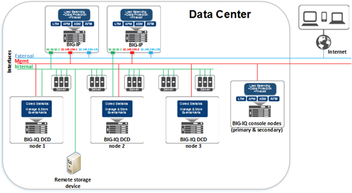
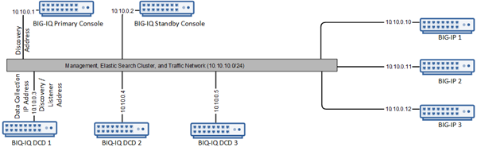
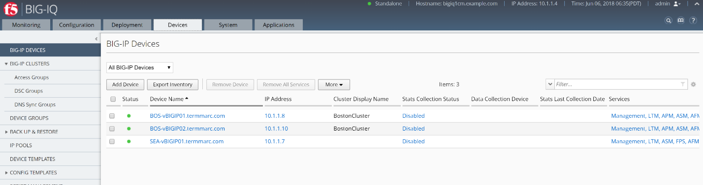
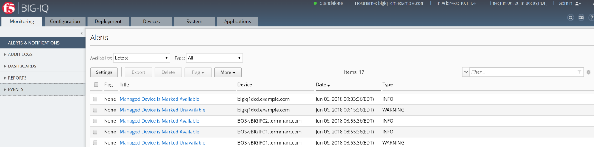
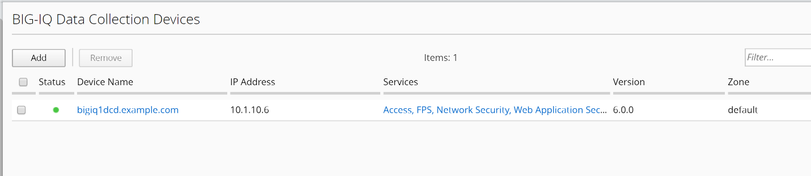
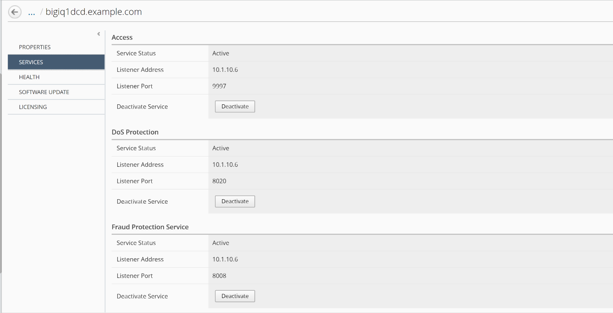

LAB 3 LICENSE MANAGEMENT 
=========================

Goal:

The following labs will get you familiar with the BIG-IQ for managing
licenses for the BIG-IP devices from BIG-IQ.

BIG-IQ has the ability to act as a license server for BIG-IP VE devices.
Using Registration Keys, this function allows customers to move VE keys
from one device to another without having to contact F5 support. A
software license is specific to F5 product services (for example,
BIG-IP® LTM®, BIG-IP APM®, and so forth), and is organized in
a \ *license pool*. Each license pool contains a specific type of
license. From BIG-IQ® Centralized Management, you can easily manage
licenses in those pools for numerous devices. That means you don't have
to log in to each individual BIG-IP VE device to activate, revoke, or
reassign a license.

BIG-IQ can manage licenses for up to 5000 BIG-IP VEs. BIG-IQ can handle
various types of pool licenses, including subscription and ELA pools, as
well as allowing the customer to create their own pool of licenses out
of individual VE keys.

Types of license pools:

There are four types of license pools. You can assign, revoke, and
reassign licenses from these pools as needed.

**Purchased Pool** - Prepaid pool of a specific number of concurrent
license grants for a single BIG-IP service, such as LTM. For example, a
purchased pool of 25 licenses for BIG-IP LTM allows you to license up to
25 concurrent BIG-IP VE systems for LTM.

**Utility Pool** - Designed for service providers, utility pools contain
licenses for BIG-IP services you grant for a specific unit of measure
(hourly, daily, monthly, or yearly).

**Volume Pool** - Prepaid subscription (1 and 3-year terms) for a fixed
number of concurrent license grants for multiple BIG-IP services.

**Registration Key Pool** - A pool of single standalone BIG-IP VE
registration keys for one or more BIG-IP services. You can revoke and
reassign a license to BIG-IP VE systems without having to contact F5 to
allow the license to be moved.

Tasks:

3.1: Add licensing base-key to BIG-IQ for consumption

3.2: Assign Pool Licensing to a device BIG-IP

This workflow demonstrates the pool based licensing capabilities:

-  The ability to import single VE registration keys.

-  The steps to allocate these keys to BIG-IP devices.

-  The ability to report on the license usage.

1. First, we must obtain some registration keys for use in this lab.

   Your lab instructor will provide the keys in a separate location.

**The following steps are for internal only and shall not be part of the
lab guide for attendees.**

**<<<<**

To generate these keys, access the f5 license server to generate a new
base registration key:

https://license.f5net.com/devkeygenerator/

1. Log in with your F5 credentials, and create the keys.

   There are three different types of license pools that we will be
   generating, along with two standalone VE keys, that we will create
   our own pool from.

   **Please generate all four-license types. **

   The keys will be sent to your corporate email account, based on your
   login to the dev key generator site.

   NOTE: All the keys that will be generated are under the **BIG-IP**
   product line in the license generator.

   ***License Types***

   a. ***Purchased License Pools -*** are purchased once, and you assign
      them to a number of concurrent BIG-IP VE devices, as defined by
      the license. These licenses do not expire. Purchased license pools
      contain VEP in the name of the license.

    |image0|

a. ***Volume License Pools -** provide* are prepaid for a fixed number
   of concurrent devices, for a set period of time, but have a number of
   different license offerings available in the pool. Volume license
   pools contain VLS in the name of the license.

    |image1|

a. ***Utility licenses pools -*** provide the customer the ability to
   use licenses as they need them, and true up with F5 for their actual
   usage. VE licenses can be granted with usage billing at an hourly,
   daily, monthly, or yearly interval. Utility license pools contain
   MSP-LOADV in the name of the license.

    |image2|

a. **Registration license key pools** - Standalone virtual edition
   registration keys can now be managed by BIG-IQ, as of the 5.1
   release. You can take any VE keys and create your own pool on the
   BIG-IQ. Once these keys are activated on BIG-IQ, the same mobility
   that was provided by the license pools is available for the
   individual keys. For this lab, we will create **two** LAB VE
   standalone keys to put in our pool.

    |image3|

    **Don’t forget to generate 2 keys here:**

    |image4|

1. Check your F5 email account for the license keys. Creation of the
   keys may take some time, so you may want to skip to the next workflow
   and return here after completing that workflow.

   >>>

Task 3.1: Add licensing base-key to BIG-IQ for consumption
~~~~~~~~~~~~~~~~~~~~~~~~~~~~~~~~~~~~~~~~~~~~~~~~~~~~~~~~~~

1. Navigate to **LICENSE MANAGEMENT** > **Licenses** under the
   **Device** tab. (Represents device operations)

   |image5|

2. Click **Add License**

    |image6|

1. Fill in the form for your purchased license pool (VEP) (Use the key
   from your email)

   |image7|

   License Name: PurchasedPool\_1G\_Best

   Copy and Paste the VEP license key obtained from your lab instructor.

2. Click **Activate** in the lower right

3. Click **Accept** in the lower right to accept the EULA.

4. Repeat steps 6-8 for the Volume license pool (VLS) (Use the key from
   your email)

   |image8|

5. While the Volume Pool is activating, click on the pool name to see
   the activation of all of the offering types for the pool.

License Name: VolumeLicensePool\_10G\_Best

Copy and Paste the VLS license key obtained from your lab instructor.

|image9|

|image10|

**Note:** This pool will not be active until all of the offerings
complete activation.

1. Click the arrow at the top of the pool properties screen to add the
   next pool.

   |image11|

2. Repeat steps 6-8 for the Utility license pool (MSP) (Use the key from
   your email)

License Name: UtilityLicensePool

Copy and Paste the MSP license key obtained from your lab instructor.

|image12|

    NOTE: Utility pools activate offerings, just like the Volume pools,
    so the same holds true that the pool will not be active until the
    offerings are activated.

1. | Now, we will create a new pool to hold our LAB VE keys. Click the
     **New RegKey Pool** button.
   | |image13|

2. Fill out the Registration Key pool name:

   |image14|

3. Click the **Add RegKey** button to add your first LAB VE key:

   |image15|

4. Add the first LAB VE key to the pool.

   |image16|

5. Click **Activate** in the lower right.

6. Click **Accept** in the lower right to accept the EULA.

   |image17|

7. Repeat step 16-18 for your second LAB VE regkey.

8. You should now have a screen that looks like this:

|image18|

1. Now that we have all these different key types available in BIG-IQ,
   we will use BIG-IQ to push a license to a device.

Task 3.2 Assign Pool Licensing to a device BIG-IP
~~~~~~~~~~~~~~~~~~~~~~~~~~~~~~~~~~~~~~~~~~~~~~~~~

1.  We will start by granting one of our LAB VE keys.

2.  Select the license that you want to assign to a device and click the
    **Assign** button. |image19|

3.  You can assign the licenses to managed devices or unmanaged devices
    from BIG-IQ.

    For this lab, you should avoid giving licenses to BOS-vBIG-IP01 or
    BOS-vBIG-IP02. We are going to test Managed device licensing by
    using SEA-vBIG-IP01.

    | Select **Managed Device**
    | Device: SEA-vBIG-IP01.termmarc.com

    |image20|

4.  Click the Assign button in the lower right.

5.  Click the OK button to proceed with the assignment of the license.
    |image21|

6.  You should now see that license as assigned out of the pool to
    Device Name: SEA-vBIGIP01.termmarc.com with the License Status as
    “Licensed”.

    |image22|

7.  | You can also view all assignments by clicking on Assignments in
      the left hand menu
    | |image23|

    |image24|

8.  | Now we can create a report that shows our license usage. Click the
      Report button below Assignments.
    | |image25|

9.  We will generate a Historical Report that shows the license
    assignments that we have done today.

    | Select Type: Historical Report
    | Licenses: All License Types
    | **Move all license pools from Available to Selected**
    | Usage period: Leave Starting Date and Ending Date as today’s date.
    | |image26|

10. Click Download in the lower right lower corner to download the
    reports

11. | If your browser raises a question about downloading multiple
      files, click Allow:
    | |image27|

12. Review the CSV files that are downloaded.

.. |image6| image:: media/image7.png
   :width: 6.48958in
   :height: 1.66667in
.. |image7| image:: media/image8.png
   :width: 5.03062in
   :height: 2.71841in
.. |image8| image:: media/image9.png
   :width: 5.04104in
   :height: 2.71841in
.. |image9| image:: media/image10.png
   :width: 6.50000in
   :height: 1.82917in
.. |image10| image:: media/image11.png
   :width: 3.04129in
   :height: 3.48915in
.. |image11| image:: media/image12.png
   :width: 4.89522in
   :height: 0.98946in
.. |image12| image:: media/image13.png
   :width: 5.10353in
   :height: 2.82256in
.. |image13| image:: media/image14.png
   :width: 3.19752in
   :height: 0.96863in
.. |image14| image:: media/image15.png
   :width: 4.50833in
   :height: 2.09583in
.. |image15| image:: media/image16.png
   :width: 6.50000in
   :height: 2.73333in
.. |image16| image:: media/image17.png
   :width: 6.49583in
   :height: 3.25417in
.. |image17| image:: media/image18.png
   :width: 6.49167in
   :height: 4.17500in
.. |image18| image:: media/image19.png
   :width: 6.49167in
   :height: 2.40417in
.. |image19| image:: media/image20.png
   :width: 3.66621in
   :height: 1.44774in
.. |image20| image:: media/image21.png
   :width: 6.23750in
   :height: 2.79583in
.. |image21| image:: media/image22.png
   :width: 6.50000in
   :height: 1.60139in
.. |image22| image:: media/image23.png
   :width: 6.50000in
   :height: 1.85417in
.. |image23| image:: media/image24.png
   :width: 2.31221in
   :height: 1.02071in
.. |image24| image:: media/image25.png
   :width: 6.50000in
   :height: 1.12500in
.. |image25| image:: media/image26.png
   :width: 1.77061in
   :height: 0.95821in
.. |image26| image:: media/image27.png
   :width: 6.49583in
   :height: 3.79583in
.. |image27| image:: media/image28.png
   :width: 3.62455in
   :height: 1.19777in
