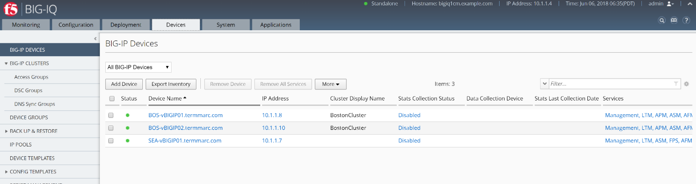
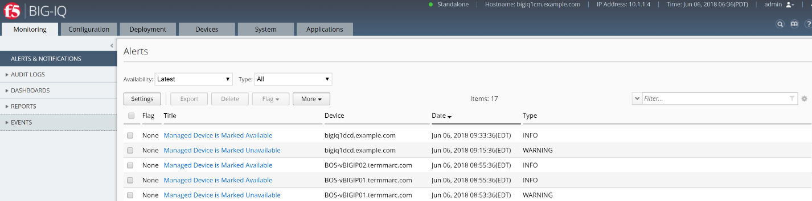
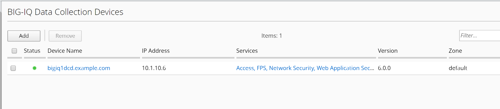
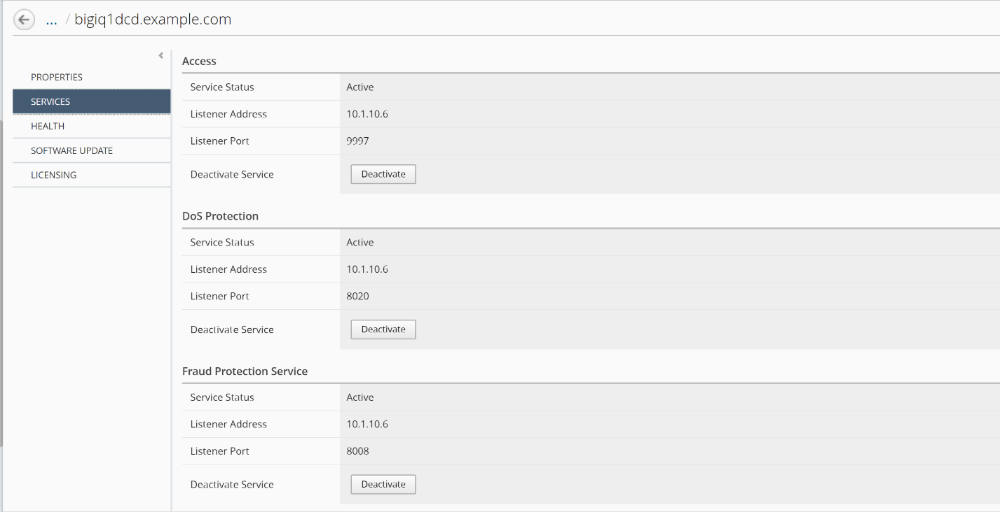

LAB 4 ROLE MANAGEMENT
=====================

**About role-based user access**

BIG-IQ provides you with the tools you need to provide granular access
to users. You decide what BIG-IP objects a user interacts with, and how.
You use these BIG-IQ components for applying role-based user access.

|image0|

BIG-IQ 5.4 first introduced the ability to create Custom Role Types and
Resource Groups. The custom role types allow the admin to create
additional roles types. The admin can set exactly what actions are
permitted on which object types. The resource group functionality allows
the admin to dictate what objects can be acted on by a user or group.
The custom role type and resource group can be combined to create a
custom role.

Roles can be created with two different modes:

    Relaxed Mode - Users can view all objects related to the service(s)
    they have access to, but can modify only those they have explicit
    permission to. This is the default.

    Strict Mode - User can view or modify only the objects they have
    explicit permission to.

BIG-IQ® Centralized Management makes it easy for you to give users
specific permissions for access only to those BIG-IP® objects they need
to do their job. Role-based access allows you to create a custom role
with specific privileges to view or edit only those BIG-IP objects
(resources) you explicitly assign to the role.

**Pre-requisites for providing custom role-based access to an
application**

To complete this use case, you must have administrator access to BIG-IQ
and have:

-  Configured BIG-IQ.

-  Discovered a BIG-IP device and imported the LTM service.

-  Configured the SharePoint application on that BIG-IP device.

-  Configured authentication for your users. In this use case scenario,
   we use BIG-IQ local authentication.

There are several built-in roles shipped with BIG-IQ, but there might be
a reason you want to give a person one or set of permissions to interact
only in a clearly defined way with specific resources. To do that, you
need to add each of the following to BIG-IQ:

1. **Custom role type** - Select one or more services and define a set
   of permissions (read, add, edit, delete) for interacting with the
   objects associated with selected services.

2. **Custom resource group** - Select the specific type of resources you
   want to provide a user access to—for example, BIG-IP virtual servers.

3. **Custom role** - Associate this custom role with the custom role
   type and resource group you created, to combine the permissions you
   specified in the custom role type with the resources you defined for
   the custom resource group.

4. **Custom user** - Associate this user with the custom role you
   created to provide that person access and permissions to the
   resources you specified.

Goal:

The following labs will get you familiar with managing Role Based Access
Control for the BIG-IP devices from BIG-IQ Centralized Management
console. There are several built-in roles shipped with BIG-IQ, but there
might be a reason you want to give a person one or set of permissions to
interact only in a clearly defined way with specific resources.

The first step to providing your user access to an application is to
create a **custom \ *role type*** and define a set of permissions to
specify how that role type interacts with objects that are associated
with a service. Then you can create a **resource group** that contains
the specific virtual server hosting your application so that you can
associate this role type and resource group to a role.

Tasks:

4.1: Create a custom role type to give permissions to BIG-IP object
types

4.2: Create a resource group and associate it with a role type

4.3: Add new custom role

4.4: Add a user to a custom role

4.5: Test access privileges for the user with the custom role

Task 4.1 - Create a custom role type to give permissions to BIG-IP object types
~~~~~~~~~~~~~~~~~~~~~~~~~~~~~~~~~~~~~~~~~~~~~~~~~~~~~~~~~~~~~~~~~~~~~~~~~~~~~~~

Objective
^^^^^^^^^

Creating a custom role type is the first step to providing custom role-based access to users.
^^^^^^^^^^^^^^^^^^^^^^^^^^^^^^^^^^^^^^^^^^^^^^^^^^^^^^^^^^^^^^^^^^^^^^^^^^^^^^^^^^^^^^^^^^^^^

|image1|

Steps:
^^^^^^

1. At the top of the screen, click System.

2. On the left, click ROLE MANAGEMENT > Role Types.

3. Near the top of the screen, click the Add button.

4. In the Name field, type a name to identify this new role type.

   | Name: **MyNetworkSecurityRole**
   | Select Service: **Network Security (AFM)**

5. Scroll through the Object Type list and select the check box next to
   each Object Type you want to provide access to. For this lab, we will
   check the box to the left of the Object Type header to select ALL
   object types.

6. Click on Add Selected to add the selected services to the Selected
   Object Types area at the above.

7. Select the check box next to Select All beneath the permissions you
   want to grant for this role type.

    |image2|

1. Before saving the custom role type, we are going to customize the
   Permissions for this new custom role type.

   **Uncheck** the checkbox next to Add, Edit and Delete on the
   following rows:

   Address Lists

   Rule Lists

   |image3|

   |image4|

   Now you have a custom role type that has some custom privileges for
   some of the Network Security objects such as Rule Lists and Address
   Lists.

2. Click the Save & Close button at the bottom of the screen.

    Next, you need to create a resource group and associate it with this
    newly created custom role type.

Task 4.2 - Create a resource group and associate it with a role type
~~~~~~~~~~~~~~~~~~~~~~~~~~~~~~~~~~~~~~~~~~~~~~~~~~~~~~~~~~~~~~~~~~~~

Objective
^^^^^^^^^

Create a resource group with all of the BIG-IP objects you want to provide access to, and assign a role type to it.
^^^^^^^^^^^^^^^^^^^^^^^^^^^^^^^^^^^^^^^^^^^^^^^^^^^^^^^^^^^^^^^^^^^^^^^^^^^^^^^^^^^^^^^^^^^^^^^^^^^^^^^^^^^^^^^^^^^

|image5|

Steps:
^^^^^^

1. Click ROLE MANAGEMENT > Resource Groups on the left navigation area.

2. Near the top of the screen, click the Add button.

3. In the Name field, type a name to identify this group of resources,
   from the Role Type list, select the role type you want to provide
   access to for this group of resources.

    Name: **NsresGroup**

    | Description: **Network Security Resource Group**
    | Role Type: **MyNetworkSecurityRole**

1. From the Select Service list, select the service(s) you want to
   provide access to for this group of resources. From the Object
   Type list, select the type of object you want to add to this group of
   resources.

   | Select Service: **Network Security (AFM)**
   | Select Object Type: **Firewall Policies**

2. For the Source setting, leave the default “Source: Selected
   Instances” unchanged.

   -  Selected Instances - Select this option to put only the source
      objects you selected into this resource group. If you select this
      option, the associated role will not have access to any new
      objects of the same type added in the future unless you explicitly
      add it to this resource group.

   -  Any Instance - Select this option if you want the associated role
      to have any instance of the specified object type, including
      future instances (newly configured objects of this type).

3. Select the check box next to the name of each object you want to add
   to this group of resources and click the Add Selected button.

   |image6|

4. Click the Save & Close button.

Next, you can create a custom role and associate this role type and
resource group to the new role.

Task 4.3 - Add new custom role
~~~~~~~~~~~~~~~~~~~~~~~~~~~~~~

Objective
^^^^^^^^^

In addition to the built-in roles that ship with BIG-IQ, you can create a custom role with specific privileges to particular areas of BIG-IQ and BIG-IP devices.
^^^^^^^^^^^^^^^^^^^^^^^^^^^^^^^^^^^^^^^^^^^^^^^^^^^^^^^^^^^^^^^^^^^^^^^^^^^^^^^^^^^^^^^^^^^^^^^^^^^^^^^^^^^^^^^^^^^^^^^^^^^^^^^^^^^^^^^^^^^^^^^^^^^^^^^^^^^^^^^^

|image7|

1. On the left, click ROLE MANAGEMENT > Roles.

2. Under CUSTOM ROLES > **Service Roles**, click the Add button.

3. In the Name field, type a name to identify this new role. From
   the Role Type list, select the kind of role you want to add.

    Role Name: **NSManager**

    Description: **Network Security Manager**

    Role Type: **MyNetworkSecurityRole**

You might have to resize the bottom half of the screen to see all of the
following options.

1. For the Role Mode setting,

   -  **Relaxed Mode** – If you select this option, the role can view
      and manage all objects you've given explicit permission to, and it
      can see (but won't be able to manage) related objects for
      associated services.

   -  Strict Mode – If you select this option, this role can view and
      manage only the specific objects you’ve given explicit permission
      to.

Leave this in Relaxed Mode so you don't unintentionally limit an
associated user's ability to see related objects.

1. Select the Resource Groups from the Available area and add them to
   the right Selected area.

   Resource Groups: **NsresGroup**

   |image8|

2. To view the type of user access granted for the custom resource group
   associated with this role, click the View Permissions button.

    |image9|

    Pay attention to the Type, Services and Resource Groups columns and
    note the previously customized permissions for Address Lists and
    Rule Lists.

1. Cancel the screen and click the Save & Close button at the bottom of
   the screen.

    Next, you will be able to add a user to this custom role to give the
    user specific permissions to a resource group.

Task 4.4 - Add a user to a custom role
~~~~~~~~~~~~~~~~~~~~~~~~~~~~~~~~~~~~~~

Objective
^^^^^^^^^

Add a user to a custom role to give them specific permissions to a resource group.
^^^^^^^^^^^^^^^^^^^^^^^^^^^^^^^^^^^^^^^^^^^^^^^^^^^^^^^^^^^^^^^^^^^^^^^^^^^^^^^^^^

|image10|

1. On the left navigation area, click USER MANAGEMENT > Users.

2. Click the Add button.

3. From the Auth Provider list, select the authentication method you
   want to use for this user. For this lab, we will leave the default
   selection **local (Local)** unchanged.

Important: A user must belong to a group or have an assigned role, or
authentication will fail.

1. In the User Name field, type the user name for this new user. In
   the Full Name field, type a name to identify this user.

   | Name: **nsadmin**
   | Full Name: **Network Security Manager**

2. In the Password and Confirm Password fields, type the password for
   this new locally-authenticated user.

    Password: **nsadmin**

    Confirm Password: **nsadmin**

1. Scroll down the screen and select NSManager from the Available box of
   the Roles list and move it to the right in Selected box.

    Roles: **NSManager**

1. You aren't required to associate a user group at this point; you can
   do that later if you want.

    Note

User’s access to certain parts of the BIG-IQ user interface depends on
which role they are assigned.

|image11|

1. Click the Save & Close button.

These users now have the privileges associated with the role(s) you
selected.

Next, we will test the access privileges for the new user with the
custom role.

Task 4.5 – Test access privileges for the user with the custom role
~~~~~~~~~~~~~~~~~~~~~~~~~~~~~~~~~~~~~~~~~~~~~~~~~~~~~~~~~~~~~~~~~~~

Objective
^^^^^^^^^

Test user nsadmin on the access privileges for the custom resource groups assigned.
^^^^^^^^^^^^^^^^^^^^^^^^^^^^^^^^^^^^^^^^^^^^^^^^^^^^^^^^^^^^^^^^^^^^^^^^^^^^^^^^^^^

Steps:
^^^^^^

1. Log out the admin user from the right upper corner, and log back into
   the BIG-IQ with the user “nsadmin” and password “nsadmin”, and select
   **Local** from Auth Provider list.

   |image12|

2. Click on upper left tab “Configuration”, select **Security > Network
   Security > Rule Lists** and select any rule from the list.

Note that you do not have option/permission to delete a Rule List
object.

|image13|

1. Select Address Lists on the left and select any address list object.

Note that you also **do not have** permission to delete an address list.

|image14|

1. Select Port List on the left and select any entry in the list.

   Note that you **do have** the permission to Clone, Delete and Rename
   the object.

   |image15|

.. |image0| image:: media/image1.png
   :width: 6.25000in
   :height: 2.45833in
.. |image1| image:: media/image2.png
   :width: 6.25000in
   :height: 0.70833in

.. |image6| image:: media/image7.png
   :width: 6.48750in
   :height: 2.96250in
.. |image7| image:: media/image8.png
   :width: 6.25000in
   :height: 0.72083in
.. |image8| image:: media/image9.png
   :width: 6.48750in
   :height: 2.99167in
.. |image9| image:: media/image10.png
   :width: 6.50000in
   :height: 3.07917in
.. |image10| image:: media/image11.png
   :width: 6.25000in
   :height: 0.72083in
.. |image11| image:: media/image12.png
   :width: 6.49167in
   :height: 3.22917in
.. |image12| image:: media/image13.png
   :width: 6.49167in
   :height: 2.30000in
.. |image13| image:: media/image14.png
   :width: 6.50000in
   :height: 3.65625in
.. |image14| image:: media/image15.png
   :width: 6.50000in
   :height: 3.20833in
.. |image15| image:: media/image16.png
   :width: 6.49167in
   :height: 3.21667in
