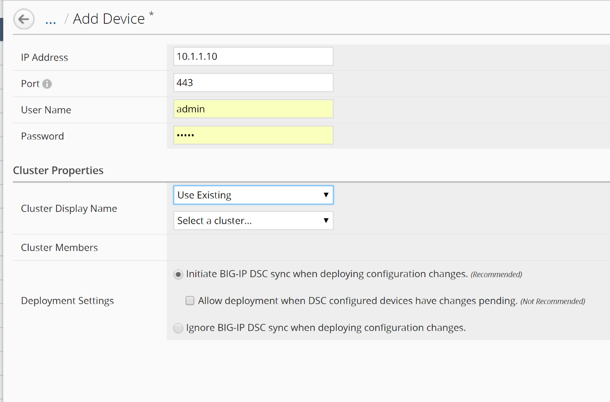
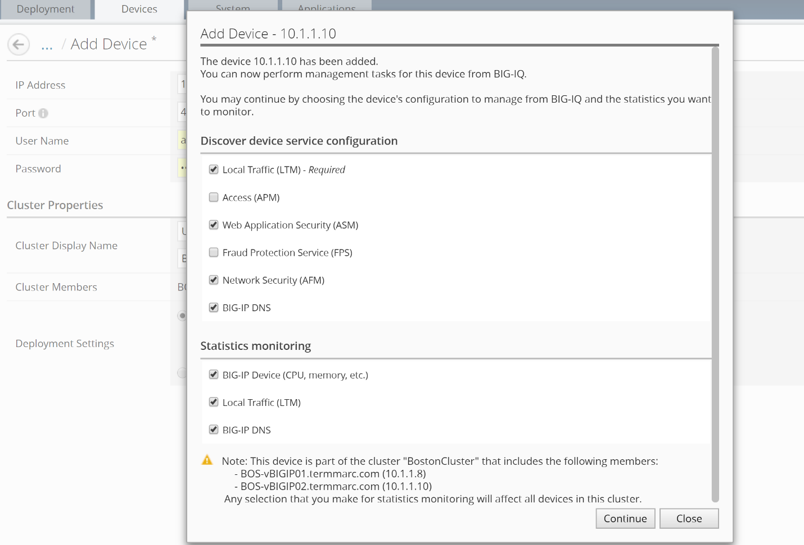
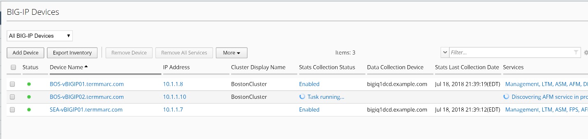

Step 1. Import a device to an existing Cluster

Log in to the BIG-IQ system with your user name (admin) and password (admin).

On the top menu bar, select Devices from the BIG-IQ menu.

On the left-hand menu bar, click BIG-IP Devices.

Click the Add Device button in the main pane.

   a. In the IP Address field, type the IP address of the device: **10.1.10.10**

   b. In the User Name and Password fields, type the user name (admin)
      and password (admin) for the device.

   c. Cluster Display Name: **Use Existing**.

   d. Select a Cluster: **BostonCluster**

   e. Leave everything else default.

Click the Add button to add this device to BIG-IQ.

BIG-IQ now exchanges certs with the BIG-IP and pops up a window for the administrator to select which modules to manage from BIG-IQ. For this device, select LTM, ASM, AFM and DNS Services. Keep the Statistics monitoring boxes all checked, and then click the Continue button.

The discovery process will start, and you should see a screen similar to the following screenshot. At this point, BIG-IQ is using REST calls to the BIG-IP to pull the selected parts of the BIG-IP configuration into BIG-IQ.

Allow the import jobs to complete. At this point, the configuration of
the BIG-IPs that have been imported are not yet editable in BIG-IQ. To
make the configurations editable in BIG-IQ, we need to complete the
import tasks.

Step 2. Import Services on the new device

On the Device Inventory screen, click the link in the Services column for BOS-vBIGIP01. (you may need to scroll right to see the services column)

In the Local Traffic (LTM) Section, select the check box for “Create a snapshot of the current configuration before importing” and click the Import button.

.. image:: image/image4.png

In the Application Security (ASM) Section, select the check box for “Create a snapshot of the current configuration before importing” and click the Import button.

.. image:: image/image5.png

There may be a window that pops up and ask you to Resolve Import
Conflicts, click Accept to resolve.

A conflict is when an object that is already in the BIG-IQ working
config has the same name, but different contents as an object that
exists on the BIG-IP that is being imported. The user must select
whether to keep the object from BIGIP or BIGIQ configuration. Storage
will be updated accordingly. Review the differences that have been
discovered as part of this import by clicking on each row in the
difference view.

Leave all default to “BIG-IQ” to keep the version of the objects that
are already in BIG-IQ.

.. image:: image/image6.png

Click the continue button.

A window reminds us that the BIG-IP will be modified to use the BIG-IQ
objects during the next deployment. Click the Resolve button to
continue.

.. image:: image/image7.png

In the Advanced Firewall (AFM) Section, select the check box for “Create a snapshot of the current configuration before importing” and click the Import button.

.. image:: image/image8.png

Again, you will experience the conflict resolution screens. Choose to
keep the objects that are already on the BIG-IQ.

In the BIG-IP (DNS) Section, click the Import button.

.. image:: image/image9.png

Click the back arrow button at the top of the section to return to the inventory.

.. image:: image/image10.png

Once you have completed all of the import tasks for BOS-vBIGIP02, click the arrow in the upper left of the Services panel to return to the device inventory screen.

.. image:: image/image11.png

Step 3. Export Inventory

Click on the BOS-vBIGIP01.termmarc.com device link to review the device Properties, Health, and Services information for the device.
 
Click through the Properties, Health, Statistics Collection, and Services tabs to review the information.

.. image:: image/image12.png

Click the arrow in the upper left of the Services panel to return to the device inventory screen.

.. image:: image/image13.png

Click the Export Inventory button in the main pane to review the contents of the device inventory CSV file

The CSV file is automatically downloaded to your client. Launch the CSV file from your downloads folder. For example, in Chrome the CSV file will appear in the lower left.

.. image:: image/image14.png

Review the contents of the file and understand all of the information that is provided.

.. image:: image/image15.png
