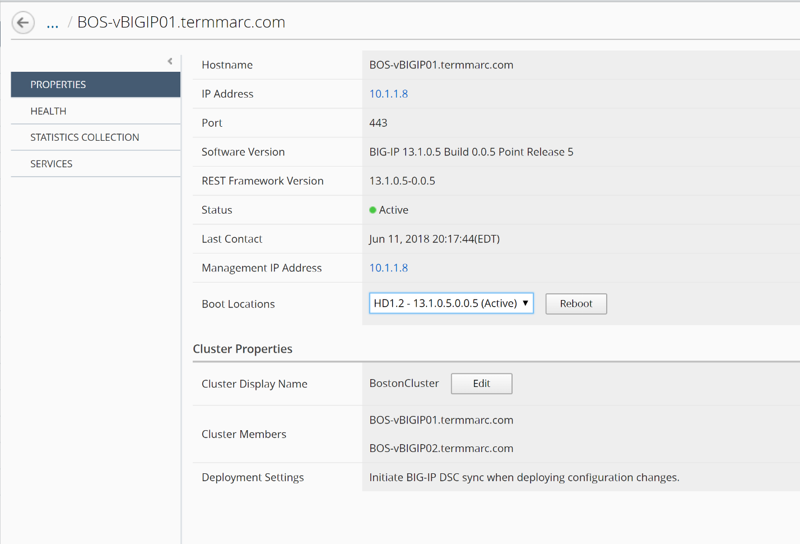

Step 3. Export Inventory

Click on the BOS-vBIGIP01.termmarc.com device link to review the device Properties, Health, and Services information for the device.
 
Click through the Properties, Health, Statistics Collection, and Services tabs to review the information.

Click the arrow in the upper left of the Services panel to return to the device inventory screen.

.. image:: image/image13.png

Click the Export Inventory button in the main pane to review the contents of the device inventory CSV file

The CSV file is automatically downloaded to your client. Launch the CSV file from your downloads folder. For example, in Chrome the CSV file will appear in the lower left.

.. image:: image/image14.png

Review the contents of the file and understand all of the information that is provided.

.. image:: image/image15.png
