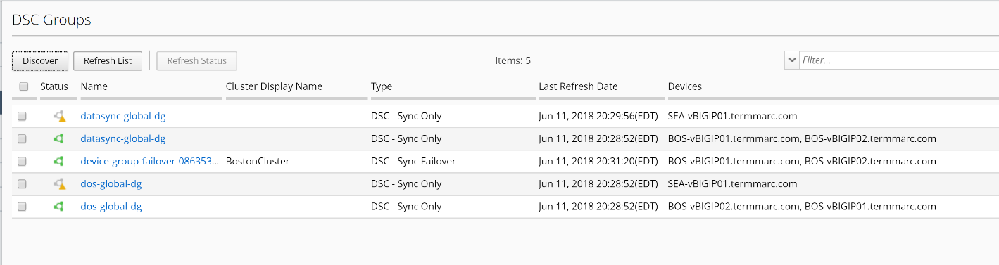
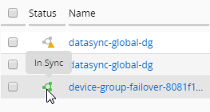
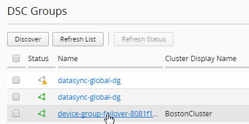
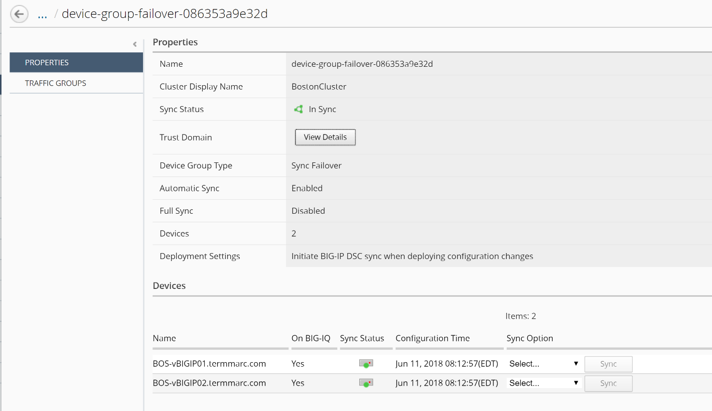
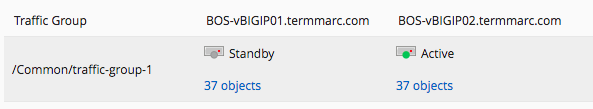

Checking DSC Group status
--------------------------

To start managing DSC devices you must add devices configured in DSC to the BIG-IP Device Inventory. 

Discover the devices into BIGIQ Inventory by assigning the clustered devices to a BIGIQ clustered group.

1.  Log in to the BIG-IQ system with your user name and password.

2.  On the top menu bar, select Devices from the BIG-IQ menu.

3.  On the left, click BIG-IP CLUSTERS.

4.  Click DSC Groups.

|image16|

5.  You can skip the discovery steps since the DSC groups have been discovered for you.

6.  Mouse over the status icons to see the status of each of the discovered clusters

|image17|

7.  Click on the cluster Name to view more details about the cluster. Choose the device-group failover link for your BostonCluster.

|image18|

8.  Review the Properties tab and notice that you can start a cluster sync operation from the bottom of the screen.

|image19|

9.  Review the Traffic Groups tab。

|image20|

10. Click the n objects link to view the objects in the traffic group.
    Close the window after the review.

