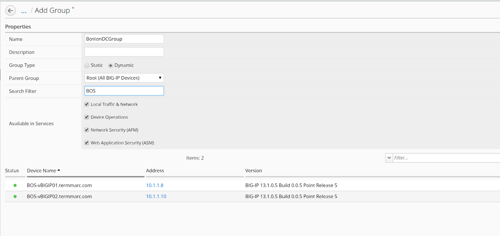
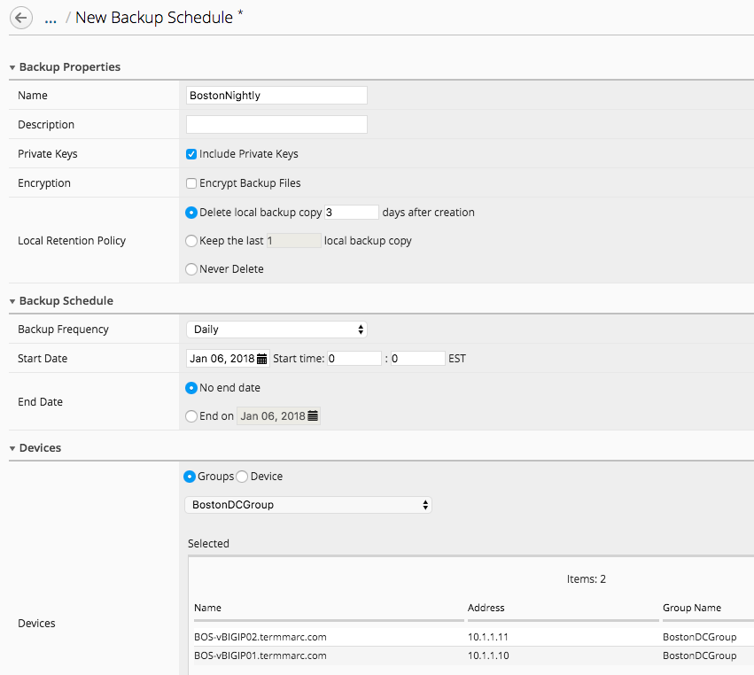
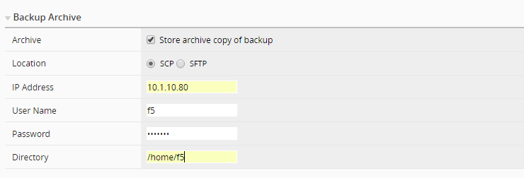

Module 3 – Automate device backups and archiving a copy of the backup file
=============================================

Task 1.3: Automate device backups and archiving a copy of the backup file 
~~~~~~~~~~~~~~~~~~~~~~~~~~~~~~~~~~~~~~~~~~~~~~~~~~~~~~~~~~~~~~~~~~~~~~~~~~

In this scenario, we are going to create a group of all of the devices
in our Boston data center and schedule a nightly backup that archives a
copy off to our archive for DR purposes.

Step 1. Create a device group

First, we need to create the group for our backup schedule to reference.
We have two options in BIG-IQ: static groups, where devices are added
and removed manually and dynamic groups, where devices are selected from
a source group based on filter criteria. In this lab setup, the devices
have BOS in the name to indicate that they are in the Boston data
center. This makes the dynamic group the logical choice.

1. On the top menu bar, select Devices from the BIG-IQ menu.

2. Click Device Groups in the left-hand menu

3. Click Create in the main pane

4. Complete the settings to create the group.

+-----------------+---------------------------------+
| Name            | **BostonDCGroup**               |
+=================+=================================+
| Group Type      | **Dynamic**                     |
+-----------------+---------------------------------+
| Parent Group    | **Root (All BIG-IP Devices)**   |
+-----------------+---------------------------------+
| Search Filter   | **BOS**                         |
+-----------------+---------------------------------+

Click the Save & Close button to save the group.

Step 2. Create a backup schedule

Now, we can create our backup schedule that references this dynamic
group.

1. Click on the Back Up & Restore on the left-hand menu

2. Click on Backup Schedules

.. image:: image/image22.png

3. Click the Create button in the main pane

4. Fill out the Backup Schedule

+--------------------------+------------------------------------------------------+
| Name                     | **BostonNightly**                                    |
+==========================+======================================================+
| Local Retention Policy   | **Delete local backup copy 3 days after creation**   |
+--------------------------+------------------------------------------------------+
| Backup Frequency         | **Daily**                                            |
+--------------------------+------------------------------------------------------+
| Start Time               | 00:00 Eastern Standard Time                          |
+--------------------------+------------------------------------------------------+

Under Devices, select the **Groups radio button**

Select from the drop-down **BostonDCGroup**

In the Backup Archive section, enter the following:

+-------------+------------------------------------+
| Archive     | **Store Archive Copy of Backup**   |
+=============+====================================+
| Location    | **SCP**                            |
+-------------+------------------------------------+
| User name   | **F5**                             |
+-------------+------------------------------------+
| Password    | **default**                        |
+-------------+------------------------------------+
| Directory   | **/home/f5**                       |
+-------------+------------------------------------+

Click Save & Close to save the scheduled backup job.

.. |image0| image:: media/image1.png
   :width: 6.49583in
   :height: 4.29167in
.. |image1| image:: media/image2.png
   :width: 6.49583in
   :height: 4.41667in
.. |image2| image:: media/image3.png
   :width: 6.50000in
   :height: 1.54167in
.. |image3| image:: media/image4.png
   :width: 1.60397in
   :height: 0.21872in
.. |image4| image:: media/image5.png
   :width: 6.50000in
   :height: 1.04444in
.. |image5| image:: media/image6.png
   :width: 6.50000in
   :height: 0.73333in
.. |image6| image:: media/image7.png
   :width: 6.48750in
   :height: 3.29167in
.. |image7| image:: media/image8.png
   :width: 5.17917in
   :height: 2.06667in
.. |image8| image:: media/image9.png
   :width: 6.50000in
   :height: 0.71667in
.. |image9| image:: media/image10.png
   :width: 6.50000in
   :height: 0.55903in
.. |image10| image:: media/image11.png
   :width: 2.26013in
   :height: 0.93738in
.. |image11| image:: media/image11.png
   :width: 2.26013in
   :height: 0.93738in
.. |image12| image:: media/image12.png
   :width: 6.49583in
   :height: 4.40833in
.. |image13| image:: media/image13.png
   :width: 3.92659in
   :height: 1.02071in
.. |image14| image:: media/image14.png
   :width: 2.45803in
   :height: 0.56243in
.. |image15| image:: media/image15.png
   :width: 6.50000in
   :height: 1.82639in
.. |image16| image:: media/image16.png
   :width: 6.45000in
   :height: 1.71250in
.. |image17| image:: media/image17.png
   :width: 2.73924in
   :height: 1.46857in
.. |image18| image:: media/image18.png
   :width: 4.35362in
   :height: 2.17681in
.. |image19| image:: media/image19.png
   :width: 6.50000in
   :height: 3.75000in
.. |image20| image:: media/image20.png
   :width: 4.80625in
   :height: 0.88320in
.. |image21| image:: media/image21.png
   :width: 6.55833in
   :height: 3.10417in
.. |image22| image:: media/image22.png
   :width: 2.28096in
   :height: 1.23943in
.. |image23| image:: media/image23.png
   :width: 6.35479in
   :height: 5.69259in
.. |image24| image:: media/image24.png
   :width: 6.50000in
   :height: 2.21319in
