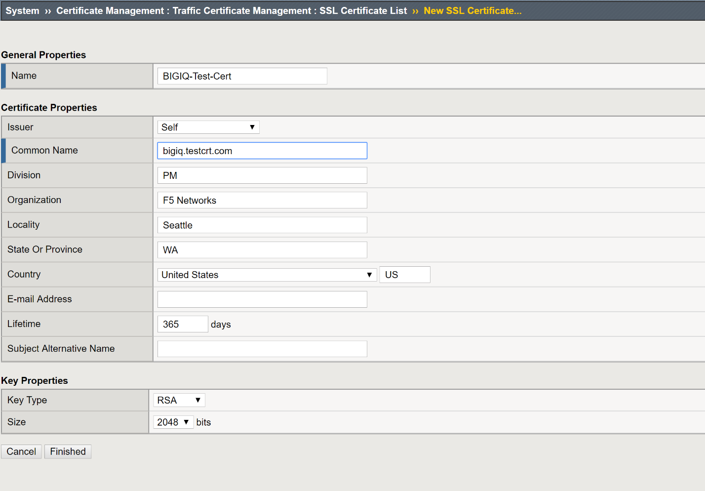
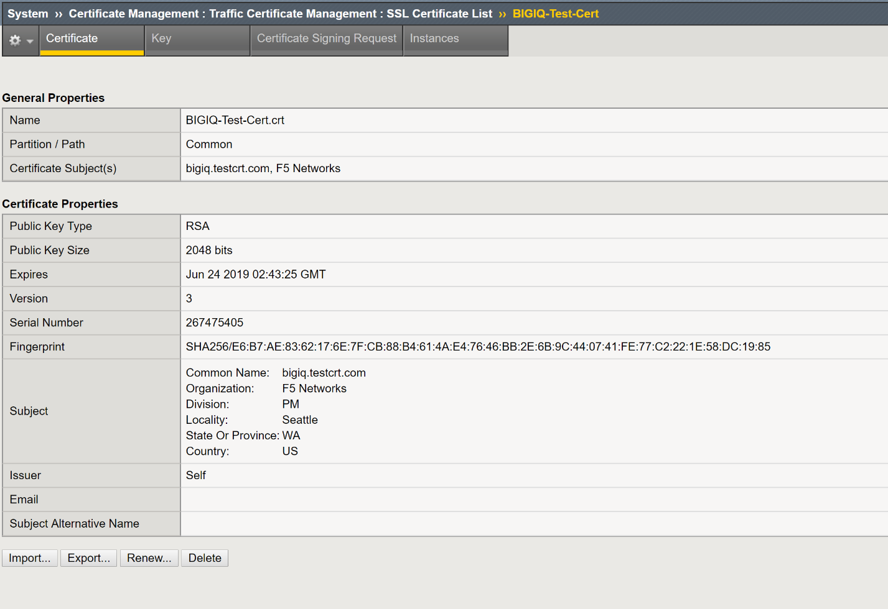
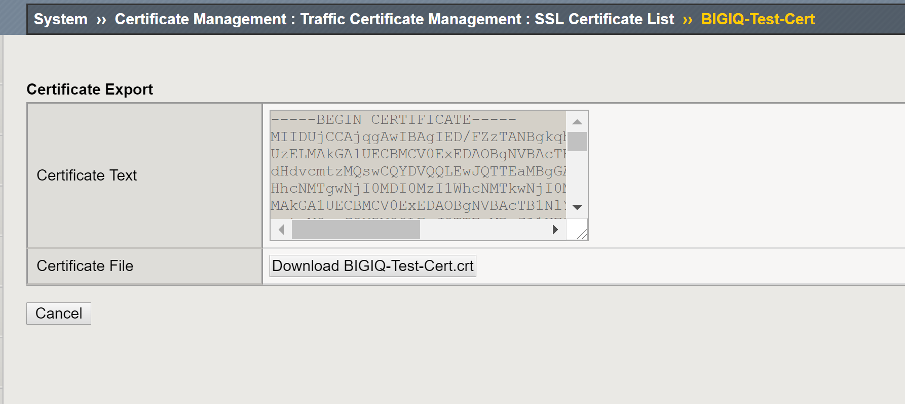
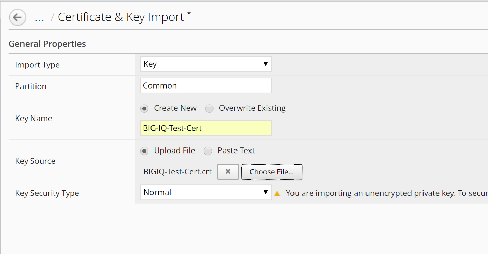
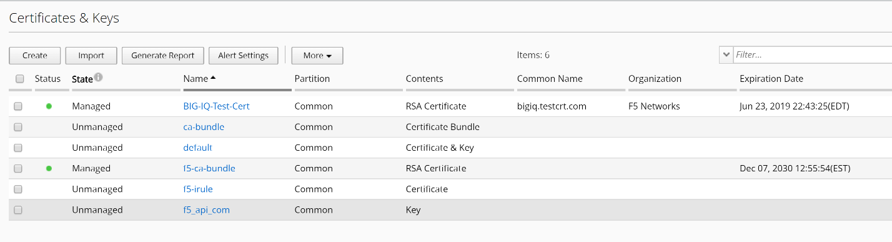

Module 2 – Create and Import a self-signed certificates/key to BIG-IQ
~~~~~~~~~~~~~~~~~~~~~~~~~~~~~~~~~~~~~~~~~~~~~~~~~~~~~~~~~~~~~~~~~~~~~

1. At the top of the screen, click Configuration.

On the left, click LOCAL TRAFFIC > Certificate Management > Certificates
& Keys.

On BOS-vBIG-IP01, create a new self-signed certificate.

Name: BIG-IQ-Test-Cert

Common Name: bigiq.testcrt.com

|image7|

|image8|

***Click on Export, and download the BIG-IQ-Test-Cert.crt file.***

|image9|

***When importing the key, select “Normal” for Key Security Type:***

|image10|

***BigIQ shows the cert/key being active (green status) and managed ***

|image11|

