MTask 2.3: Renew expired certificates and Deploy from BIG-IQ to managed BIG-IP
~~~~~~~~~~~~~~~~~~~~~~~~~~~~~~~~~~~~~~~~~~~~~~~~~~~~~~~~~~~~~~~~~~~~~~~~~~~~~

Objective
^^^^^^^^^
Renewed the expired cert on BIG-IQ

Push the new cert to SEA-vBIGIP01

Walk through deployment of Certificate changes to the BIG-IP devices.

-  Navigate to ConfigurationLocal TrafficCertificate Management Certificate & Keys

-  Renew expired certificate: app01.termmarc.com on SEA-vBIGIP01 device.

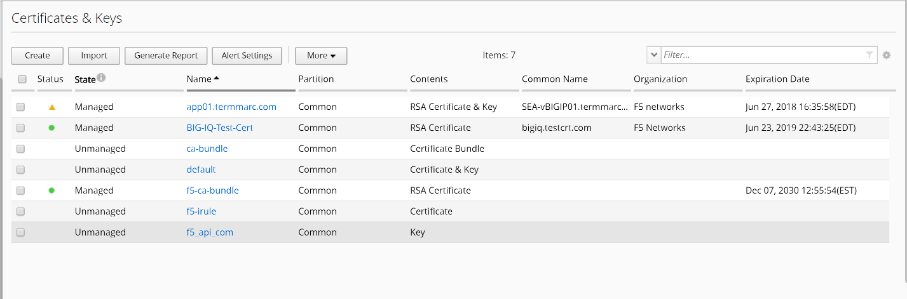

Move the mouse over to the yellow triangle in front of the Managed State
of the certificate app01.termmarc.com.

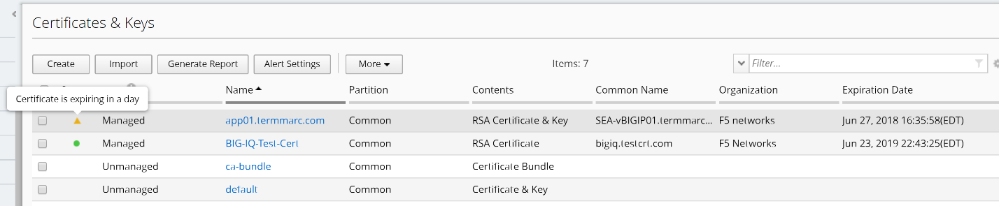

Click on the app01.termmarc.com certificate, and click on the **Renew
Certificate** button on the right upper corner.

.. image:: image/image14.png

Accept the default Duration 365 days, and click on Renew button on the
right lower corner.

.. image:: image/image15.png

The certificate is now renewed to 365 days of Duration.

1. At the top of the screen, click Deployment.

On the left, click EVALUATE & DEPLOY > Local Traffic & Network, then
click on Create button under Evaluations.

Enter a task name “\ **Deploy-Renewed-Cert**\ ”, in Evaluation section,
select Partial Changes next to Source Scope line item, the list of
Source Objects appears. Select “Certificate” from the dropdown list on
the left Available section, and move the certificate app01.termmarc.com
to the right side Selected box.

.. image:: image/image16.png

Scroll down the screen and click on “Find Relevant Devices”, you will
see SEA-vBIGIP01 listed in the Available section on the left. Select and
move the device to the right side Selected box, and click on Create
button. The evaluation starts, and you will see the Status marked as
Evaluation Complete when it is done.

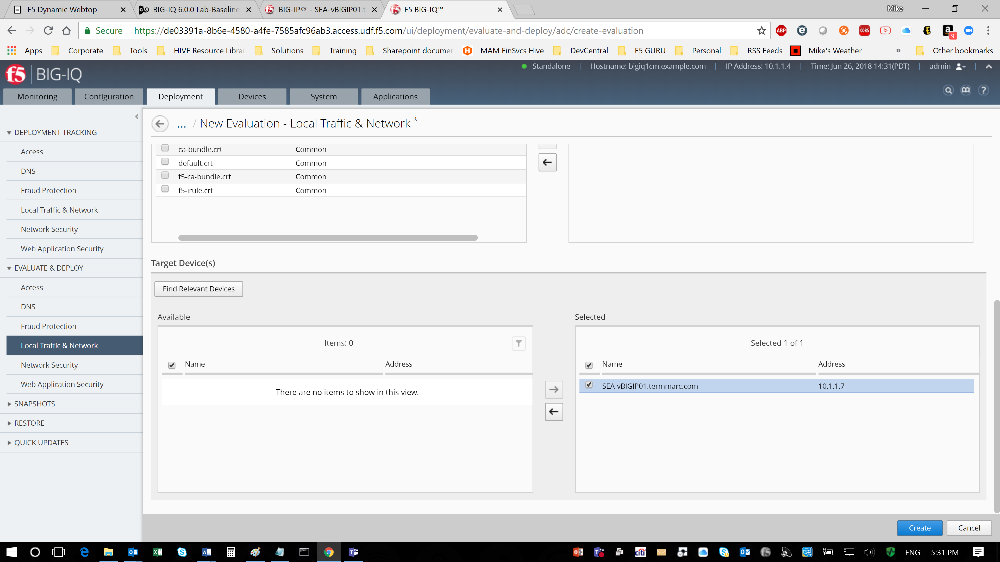

Click on the View link in the middle of the screen under Differences
column.

.. image:: image/image18.png

Review the differences between the BIG-IQ certificate and the BIG-IP
certificate for app01.termmarc.com.

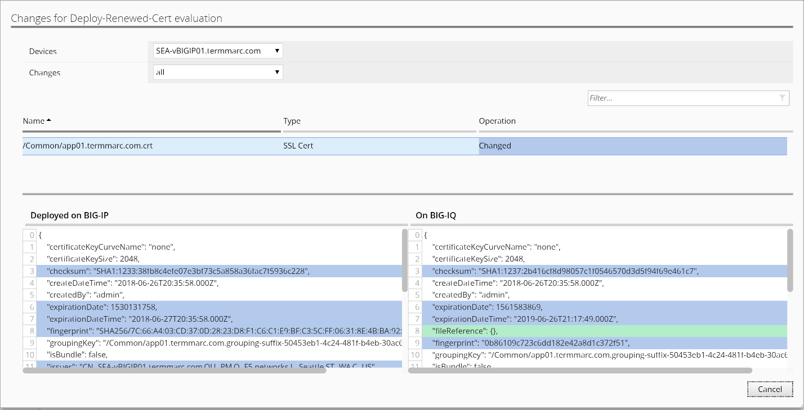

Cancel the window to return to the previous screen, select the
evaluation “Deploy-Renewed-Cert” and click on Deploy button above. Click
on Deploy again to confirm.

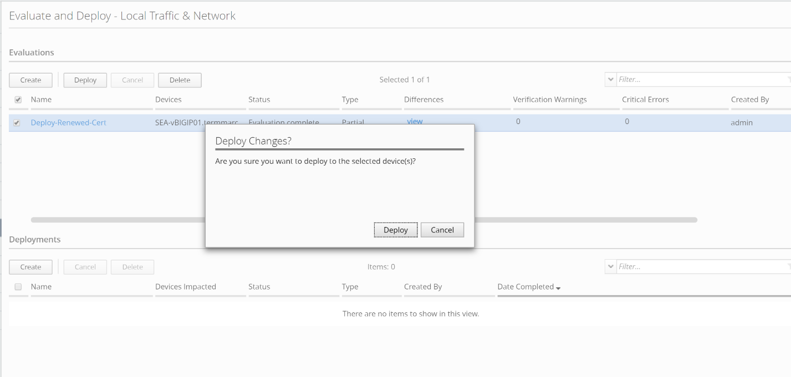

Now the deployment is completed.

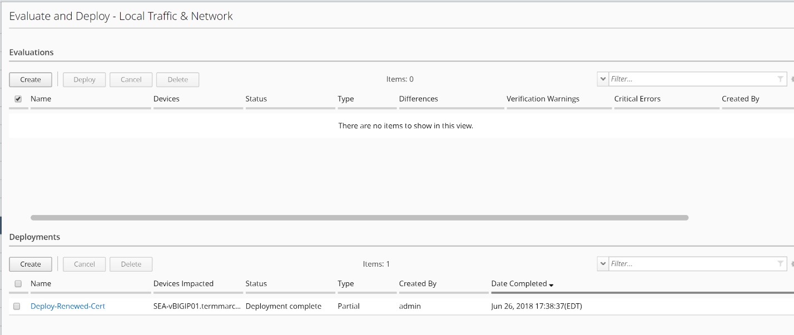

Log back into SEA-vBIGIP01 device, navigate back to System ››
Certificate Management : Traffic Certificate Management : SSL
Certificate List. Verify that the certificate app01.termmarc.com has
been renewed to 365 days duration by BIG-IQ.

.. image:: image/image22.png

.. |image12| image:: media/image12.png
   :width: 6.49167in
   :height: 2.13750in
.. |image13| image:: media/image13.png
   :width: 6.49167in
   :height: 1.34167in
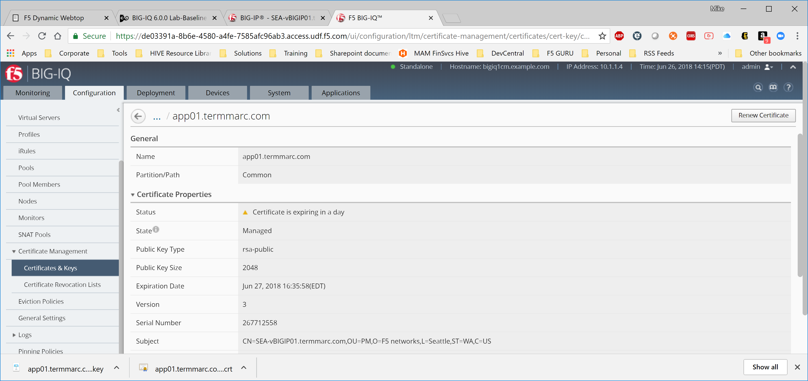
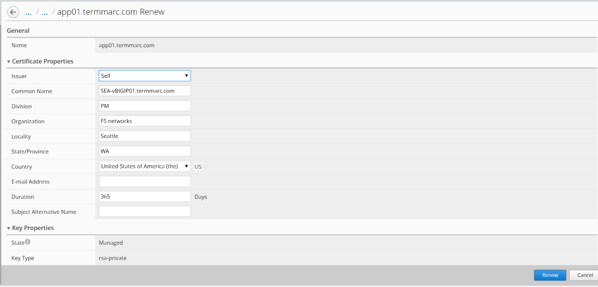
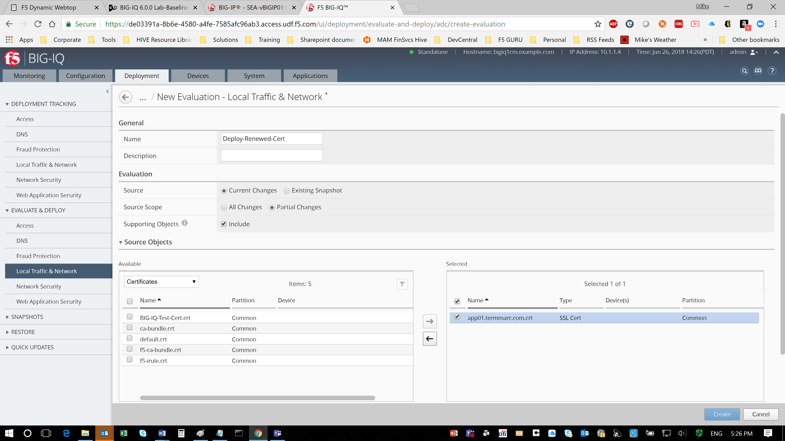
.. |image17| image:: media/image17.png
   :width: 6.50000in
   :height: 3.65625in
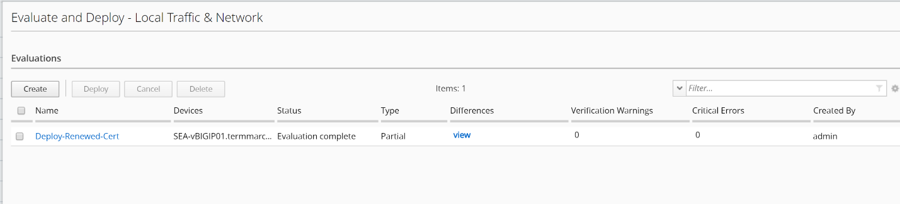
.. |image19| image:: media/image19.png
   :width: 6.48750in
   :height: 3.31250in
.. |image20| image:: media/image20.png
   :width: 6.48750in
   :height: 3.09583in
.. |image21| image:: media/image21.png
   :width: 6.49167in
   :height: 2.74167in
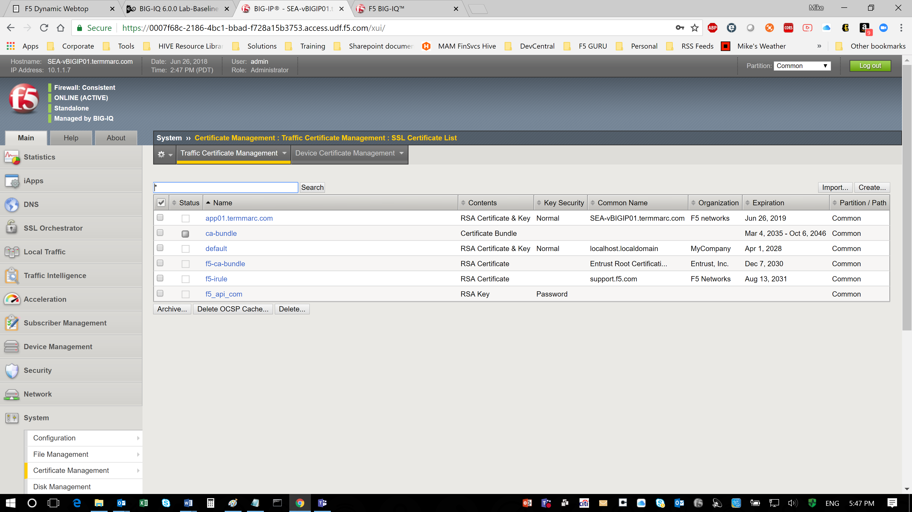
