Module 1: Add licensing base-key to BIG-IQ for consumption
~~~~~~~~~~~~~~~~~~~~~~~~~~~~~~~~~~~~~~~~~~~~~~~~~~~~~~~~~~

1. Navigate to **LICENSE MANAGEMENT** > **Licenses** under the **Device** tab. (Represents device operations)

|image6|

Click **Add License**

|image7|

Fill in the form for your purchased license pool (VEP) (Use the key from your lab instructor)

|image8|

License Name: PurchasedPool\_1G\_Best

Copy and Paste the VEP license key obtained from your lab instructor.

Click **Activate** in the lower right

Click **Accept** in the lower right to accept the EULA.

2. Repeat steps 6-8 for the Volume license pool (VLS) (Use the key from your email)

|image9|

While the Volume Pool is activating, click on the pool name to see the activation of all of the offering types for the pool.

License Name: VolumeLicensePool\_10G\_Best

Copy and Paste the VLS license key obtained from your lab instructor.

|image10|

|image11|

**Note:** This pool will not be active until all of the offerings complete activation.

Click the arrow at the top of the pool properties screen to add the next pool.

|image12|

3. Repeat steps 6-8 for the Utility license pool (MSP) (Use the key from your lab instructor)

License Name: UtilityLicensePool

Copy and Paste the MSP license key obtained from your lab instructor.

|image13|

.. NOTE::
	 Utility pools activate offerings, just like the Volume pools, so the same holds true that the pool will not be active until the offerings are activated.

4. Now, we will create a new pool to hold our LAB VE keys. Click the **New RegKey Pool** button.
   
|image14|

Fill out the Registration Key pool name:

|image15|

Click the **Add RegKey** to add your first LAB VE key:

|image16|

Add the first LAB VE key to the pool.

|image17|

Click **Activate** in the lower right.

Click **Accept** in the lower right to accept the EULA.

|image18|

Repeat step 16-18 for your second LAB VE regkey.

You should now have a screen that looks like this:

|image19|

Now that we have all these different key types available in BIG-IQ, we will use BIG-IQ to push a license to a device.

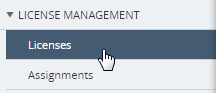
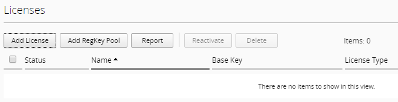
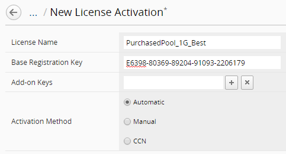
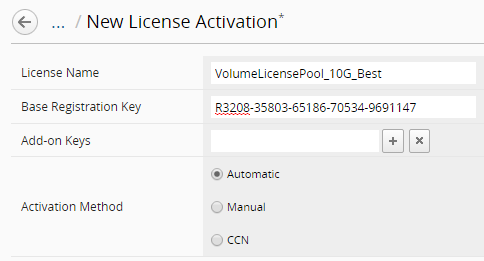
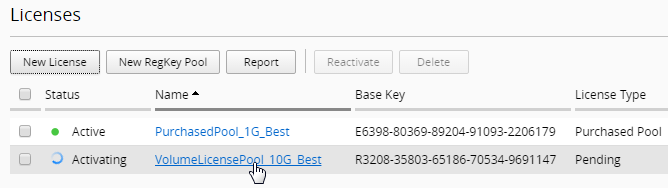
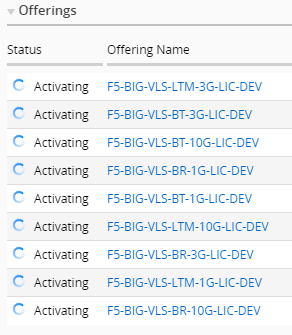
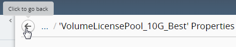
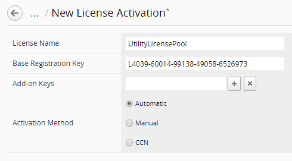
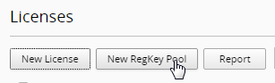
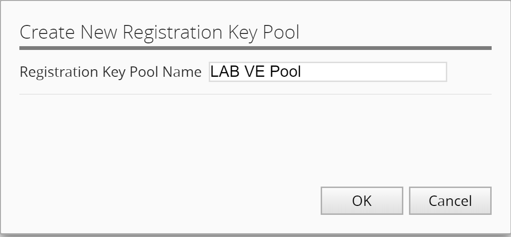
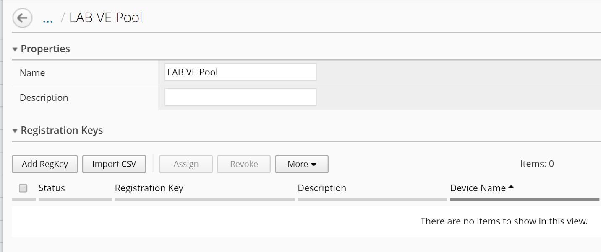
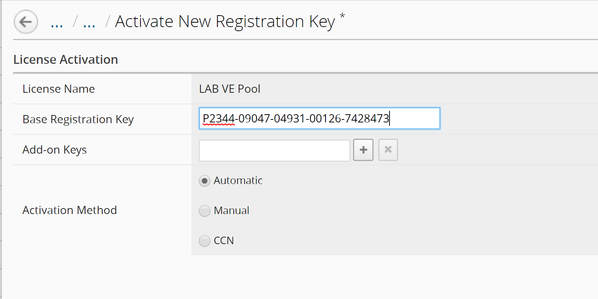
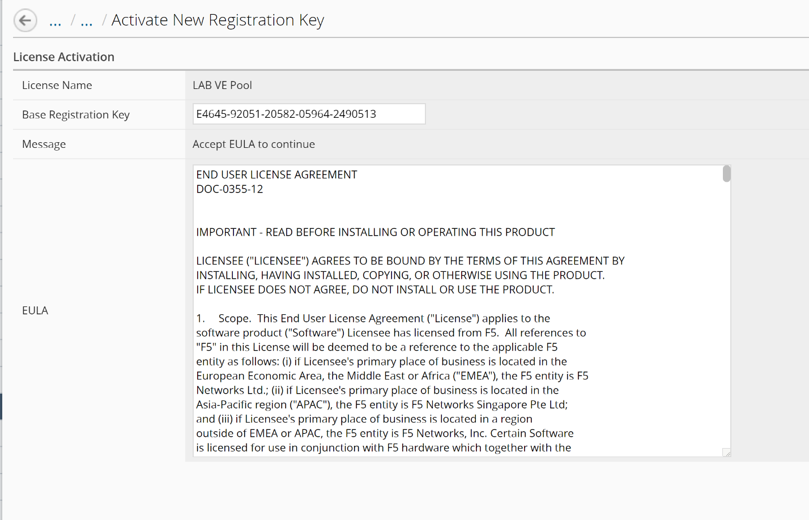
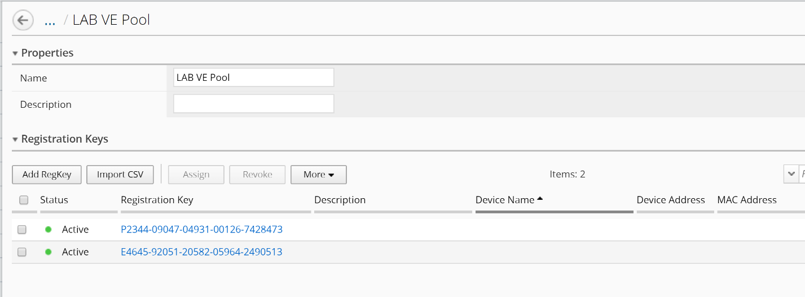