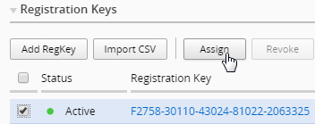
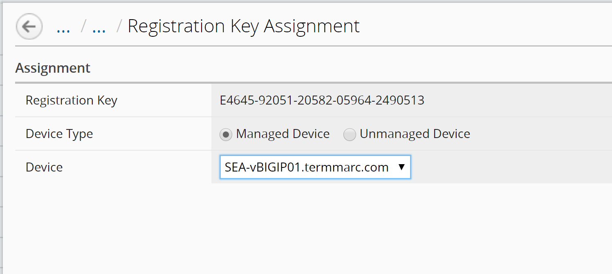
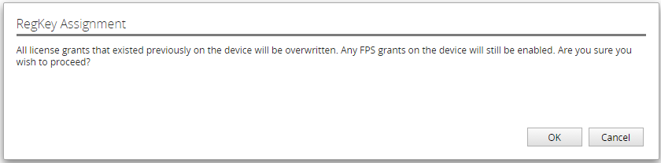
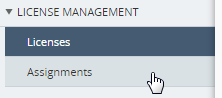
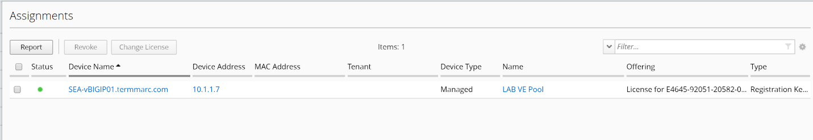
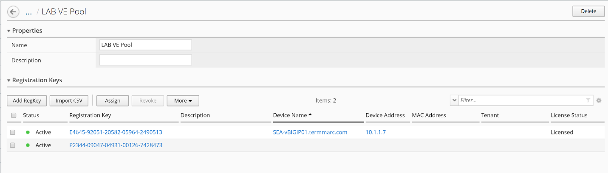
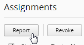
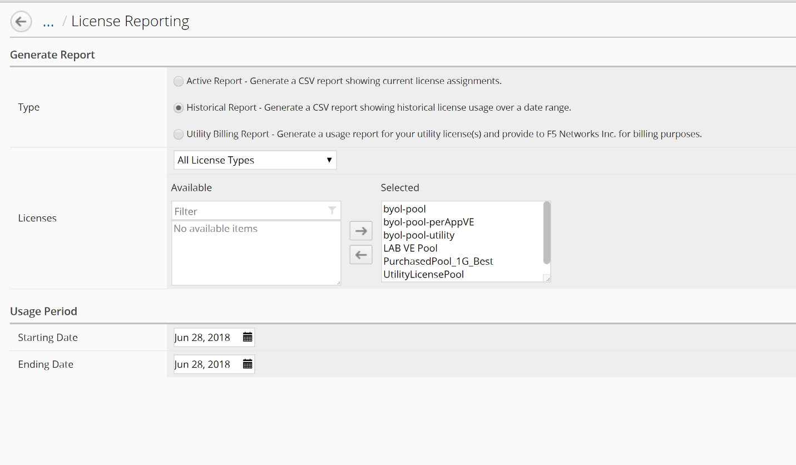
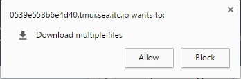

Module 2 Assign Pool Licensing to a device BIG-IP
~~~~~~~~~~~~~~~~~~~~~~~~~~~~~~~~~~~~~~~~~~~~~~~~~

Now that we have all these different key types available in BIG-IQ, we will use BIG-IQ to push a license to a device. 

We will start by granting one of our LAB VE keys.

1.  Select the license that you want to assign to a device and click the **Assign** button. 
    

You can assign the licenses to managed devices or unmanaged devices from BIG-IQ.

For this lab, you should avoid giving licenses to BOS-vBIG-IP01 or BOS-vBIG-IP02. We are going to test Managed device licensing by using SEA-vBIG-IP01.

    | Select **Managed Device**
    | Device: SEA-vBIG-IP01.termmarc.com

Click the Assign button in the lower right.

Click the OK button to proceed with the assignment of the license.

You should now see that license as assigned out of the pool to Device Name: SEA-vBIGIP01.termmarc.com with the License Status as “Licensed”.

.. image:: image/image23.png

You can also view all assignments by clicking on Assignments in the left hand menu

2.  Now we can create a report that shows our license usage. Click the Report button below Assignments.

.. image:: image/image26.png

We will generate a Historical Report that shows the license assignments that we have done today.

    | Select Type: Historical Report
    | Licenses: All License Types
    | **Move all license pools from Available to Selected**
    | Usage period: Leave Starting Date and Ending Date as today’s date.

.. image:: image/image27.png

Click Download in the lower right lower corner to download the reports

If your browser raises a question about downloading multiple files, click Allow:

.. image:: image/image28.png

Review the CSV files that are downloaded.

.. |image20| image:: media/image20.png
   :width: 3.66621in
   :height: 1.44774in
.. |image21| image:: media/image21.png
   :width: 6.23750in
   :height: 2.79583in
.. |image22| image:: media/image22.png
   :width: 6.50000in
   :height: 1.60139in

.. |image24| image:: media/image24.png
   :width: 2.31221in
   :height: 1.02071in
.. |image25| image:: media/image25.png
   :width: 6.50000in
   :height: 1.12500in

