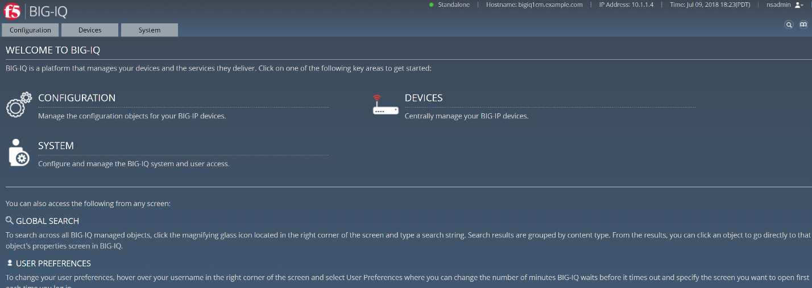
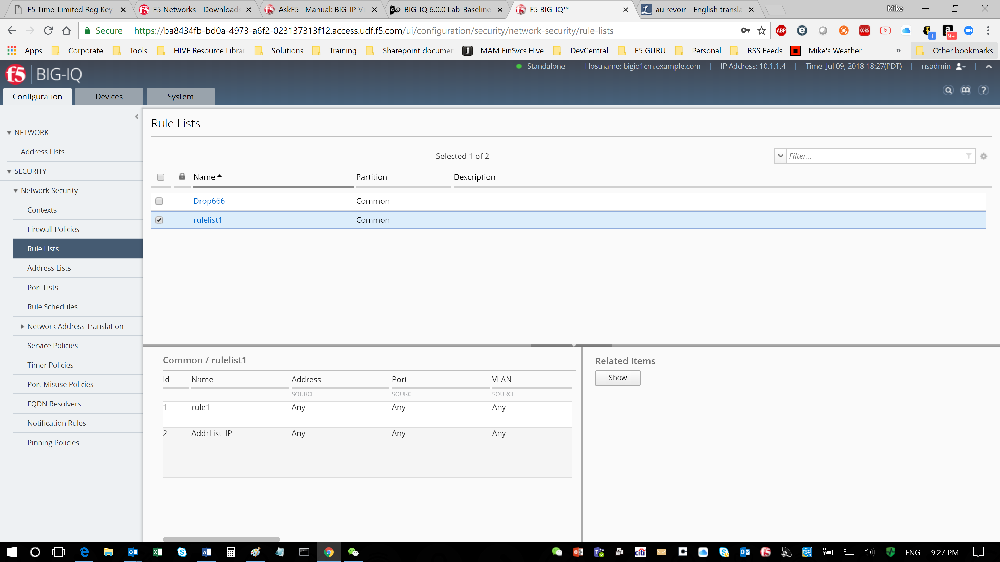
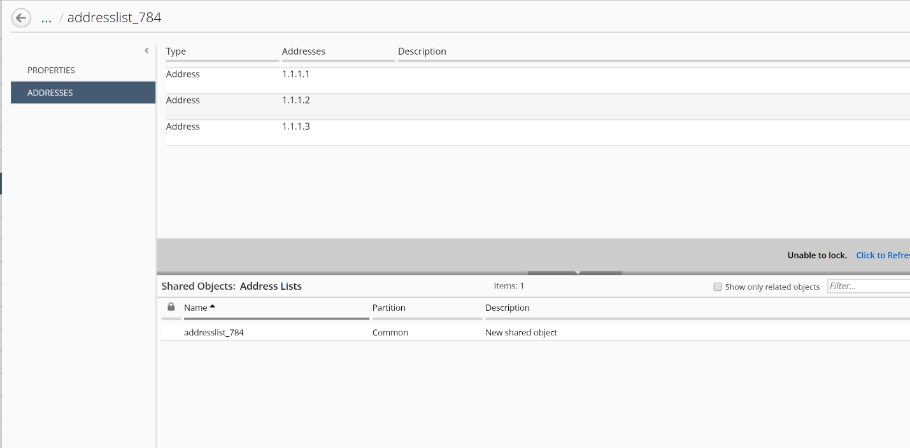
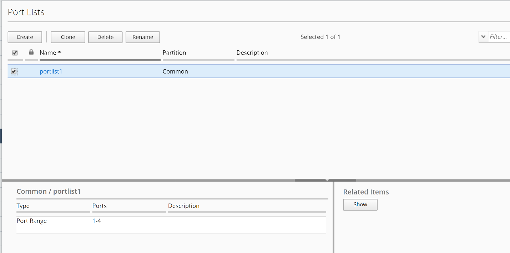

Module 5 – Test access privileges for the user with the custom role
~~~~~~~~~~~~~~~~~~~~~~~~~~~~~~~~~~~~~~~~~~~~~~~~~~~~~~~~~~~~~~~~~~~

Objective
^^^^^^^^^

Test user nsadmin on the access privileges for the custom resource groups assigned.
^^^^^^^^^^^^^^^^^^^^^^^^^^^^^^^^^^^^^^^^^^^^^^^^^^^^^^^^^^^^^^^^^^^^^^^^^^^^^^^^^^^

Steps:
^^^^^^

1. Log out the admin user from the right upper corner, and log back into
   the BIG-IQ with the user “nsadmin” and password “nsadmin”, and select
   **Local** from Auth Provider list.

.. image:: image/image13.png

2. Click on upper left tab “Configuration”, select **Security > Network
   Security > Rule Lists** and select any rule from the list.

Note that you do not have option/permission to delete a Rule List
object.

.. image:: image/image14.png

1. Select Address Lists on the left and select any address list object.

Note that you also **do not have** permission to delete an address list.

.. image:: image/image15.png

1. Select Port List on the left and select any entry in the list.

   Note that you **do have** the permission to Clone, Delete and Rename
   the object.

.. image:: image/image16.png

