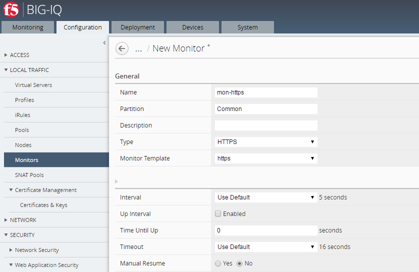

Module 1: Create multiple changes. Deploy single change
~~~~~~~~~~~~~~~~~~~~~~~~~~~~~~~~~~~~~~~~~~~~~~~~~~~~~~~

**Objective**

-  The user has the ability to select a specific change out of many made for deploy. We will try to add an additional node to the existing pool in this task.

**Partial Deployment**

1. From the tab Configuration, click on LOCAL TRAFFIC > Pools, enter “app1pool” in the upper right Filter and search, select a pool by clicking on name “app1pool” on either BOS-vBIGIP01 or 02.

|image1|

-  1\ :sup:`st` change

-  Click on New Member, select from Existing Node “app1node2” on port 80 HTTP

|image2|

-  Leave everything else default, and click on “Save and Close” on lower right

We have just made a change to the BIG-IQ configuration for app1pool on the BOS HA pair.

-  2\ :sup:`nd` change – Create a New Monitor “mon-https”

-  Click into Configuration > LOCAL TRAFFIC > Monitors and then click on “Create” button.

|image3|

-  New Monitor
   -  Name: **mon-https**

   -  Type: **HTTPS**

   -  Monitor template: **https**

   -  username: **admin**

   -  password: **admin** and confirm password.

Click “Save and Close”

|image4|

2. Next, we will add the new monitor to the app2pool.

-  Add newly created Health Monitor “mon-https” to Pool “app2pool”

   -  Under Configuration > LOCAL TRAFFIC > Pools, search app2pool in the upper right filter

   -  Select a pool by clicking on name “app2pool” on either BOS-vBIGIP01 or 02

   -  On Health Monitors, select /Common/mon-https

|image5|

-  Click Save and Close

Switch back to Deployment tab, under EVALUATE & DEPLOY, click on Local Traffic & Network

3. Next, we will create evaluation and deploy this change we just made above

Click on top Deployment tab, select under EVALUATE & DEPLOY: Local Traffic & Network

   -  Click Create under Evaluations and enter the following:

      Name: **partial-deploy**

      From Evaluation > Source Scope, Select “\ **Partial Changes**\ ”

      From Source Objects > Available, select “Pools”, from pool list, select **only “app1pool**\ ” for Both BOS-vBIGIP01 & 02, and add them to Selected on the right

      Under Target Devices, click “Find Relevant Devices”, select both and add to right

      Click “Create” to complete

|image6|

4. After the evaluation is done, you can click on the “view” link under the Difference column for “partial-deployment” evaluation.

|image7|

|image8|

.. NOTE::
	 *Only changes to “app1pool” will be deployed.* The monitor change on app2pool will not be deployed.

-  Deploy changes

   -  Cancel to dismiss the popup window and click on Deploy under
      Evaluation

   -  Confirm by click on Deploy button again.

|image9|

5. After deployment is complete, click into the “partial-deploy” to view the details of the deployment.

|image10|

.. NOTE::
	 The deployment could fail if the targeted BIG-IP devices are not in full sync on configurations, due to timeout on waiting for sync to complete on target devices. Ensure the devices are in full sync before deploying changes.

.. |image3| image:: media/image3.png
   :width: 6.22917in
   :height: 2.67708in

.. |image5| image:: media/image5.png
   :width: 6.50000in
   :height: 4.22917in
.. |image6| image:: media/image6.png
   :width: 6.50000in
   :height: 4.92361in

