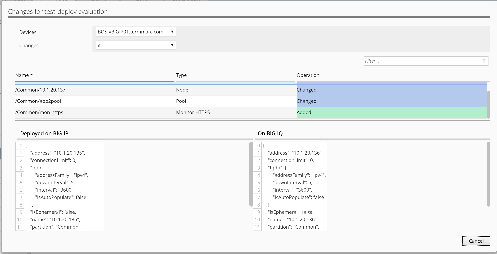
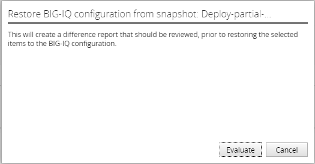

Module 2: Create and deploy multiple changes with selected roll-back. 
~~~~~~~~~~~~~~~~~~~~~~~~~~~~~~~~~~~~~~~~~~~~~~~~~~~~~~~~~~~~~~~~~~~~~~

Objective
^^^^^^^^^

In this deployment, we will be using the 1\ :sup:`st` change made to app1pool, as well as 2\ :sup:`nd` change made to app2pool in the previous task 5.1, to demonstrate the ability to partially roll back one of the two changes for this deployment.

1. First, we will need to deploy the 2\ :sup:`nd` change that consists of a new monitor to the app2pool.

-  Starting from the Deployment tab on the top, and under EVALUATE & DEPLOY, click on Local Traffic & Network on the left.

-  Click on Create under Deployments.

   Name: **Test-Deploy**

-  Ensure the default “Source Scope: All Changes” is selected

-  Select the BOS BIG-IP HA Pair from the Devices Targeted box and move them to the right Selected box.

-  Click on Create button on the bottom right to create the Evaluation of the deployment

-  Verify all changes are part of the deployment.

   -  New mon-https Health Monitor

.. image:: image/image11.png

-  Cancel the differences window to return to Evaluation list window, select **Test-deploy** and click on Deploy button above.

.. image:: image/image12.png

-  Click on Deploy button again to confirm and observe completion

   What we have done so far, is to deploy the 2\ :sup:`nd` change made to the HA pair in task 5.1, since we only deployed 1\ :sup:`st` change.

2. Next, we will do a restore of the configurations on the HA pair, by rolling back one of the two changes we just made. 

We will need to use a previous snapshot made prior to the two changes done earlier, in order to restore one of the changes.

-  Create **a Partial Restore Evaluation**.

   -  Locate RESTORE section on the left and click on Local Traffic & Network.

   -  Under Restores section, click on Create button to start a task

.. image:: image/image13.png

Name: **partial-restore**

Snapshot: **Reimport-10.1.1.10 (snapshot before the changes in task 5.1)**

Create Snapshot: check the box “\ **Create a snapshot prior to restoring**\ ”.

Restore Scope: **Partial Restore**

Method: **Create evaluation**

    Note

Duplicate names are allowed for a snapshot; therefore, the Deployment Date is provided as a reference.

User can narrow the scope of the restore from Full to Partial. For this lab let’s select Partial Restore from the Restore Scope section.

User can “Create Evaluation” or if urgent “Restore Immediately”.

.. image:: image/image14.png

-  Select “Add” for Source Objects

-  Select “/Common/app1pool” and click on “Add” to add the object to
   Selected tab.

-  Verify difference between BIG-IQ and Snapshot.

.. image:: image/image15.png

.. image:: image/image16.png

-  Click on Save to close the Select Object window, and then click on Create to start the evaluation

-  The user can restore the partial change defined from the Snapshot deployment.

.. image:: image/image17.png

.. image:: image/image18.png

Click on Restore to complete the partial restore of the change made to app1pool.

Close the complete window and click on View to see the restored configuration. You can see that the added member has been removed from app1pool.

.. |image13| image:: media/image13.png
   :width: 4.70833in
   :height: 1.05460in
.. |image14| image:: media/image14.png
   :width: 6.50000in
   :height: 4.94792in

.. |image17| image:: media/image17.png
   :width: 6.50000in
   :height: 1.57292in
.. |image18| image:: media/image18.png
   :width: 4.18547in
   :height: 2.20833in
