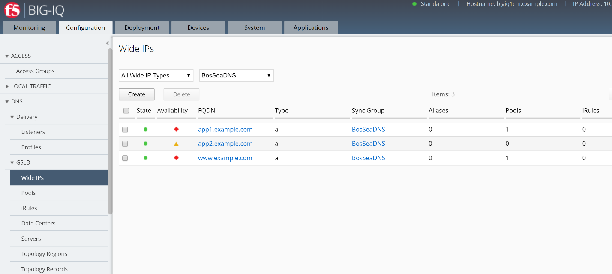
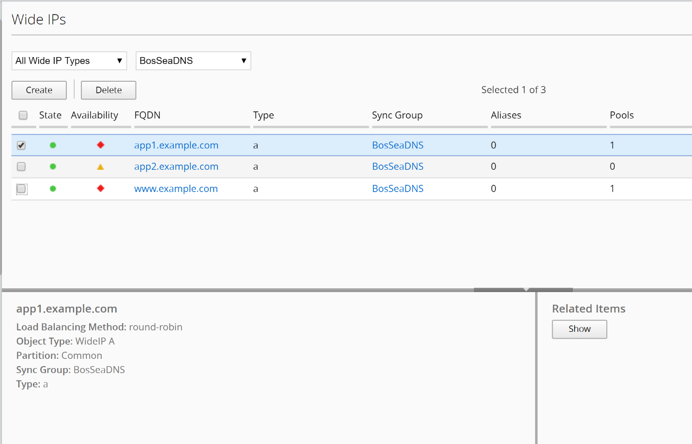
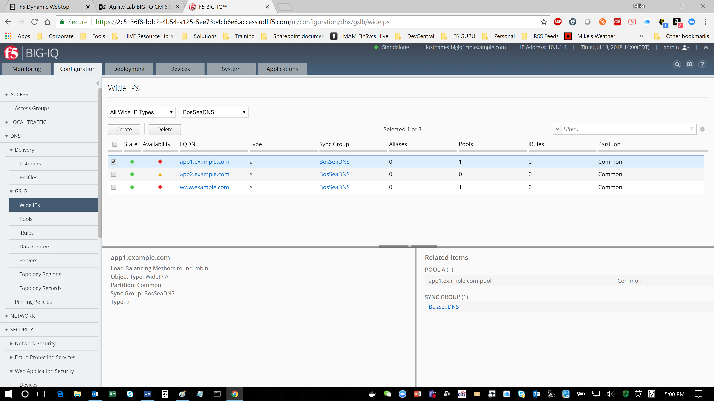
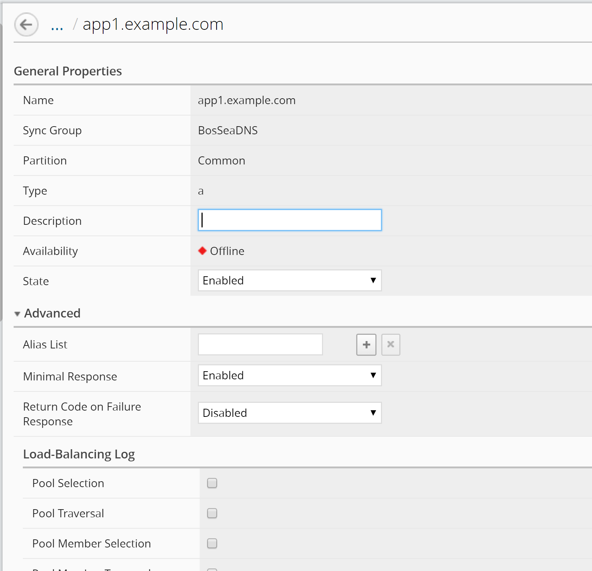

Module 4: Managing permissions for GSLB Objects
~~~~~~~~~~~~~~~~~~~~~~~~~~~~~~~~~~~~~~~~~~~~~~~

**View GSLB objects**

When you use F5 BIG-IQ Centralized Management to manage your DNS sync
group, you can view the GSLB objects that are defined on devices in the
sync group.

1. At the top of the screen, click Configuration.

2. On the left, click DNS > GSLB, and then select the object type that you want to view.

|image19|

The screen displays a list of the selected object type that are defined on devices managed by this BIG-IQ system. For each object (except topology records or topology regions), icons describe the health status and availability.

3. To view overview information about a particular object, select the check box for that object.

An overview panel and a related items panel display for this object.

|image20|

4. To see a list of related items for a GSLB object:

a. Select the check box for that object.

b. In the Related Items panel, click Show.

|image21|

You can view the list of related items; and, for many of the items, you can click on a link to view properties for that item.

5. To view the general properties for a GSLB object, click the name of that object.

The screen displays the properties for the selected object.

|image22|

**Managing permissions for GSLB Objects**

F5® BIG-IQ® Centralized Management makes it straightforward for you to
manage permissions that allow users to view GSLB objects only for the
specific DNS GSLB objects you assign to them.

To provide permissions for a specific set of objects, you perform the
following tasks.

6. **Add a custom resource group** - You can specify the GSLB objects that you want this user to work with. You create a resource group for each collection of objects that you want to assign to a user.

**Refer to Lab 4 Role Management** – Task 4.2 for details of this capability.

7. **Add a custom role** - Next, you associate the GSLB Viewer role type with the resource groups that contain the objects you want your delegates to view. For example, if you had a resource group made up of two wide IPs, one named SeattlePrime and the other named SeattleSecond you might name this role viewSeattle.

**Refer to Lab 4 Role Management** – Task 4.3 for details of this capability.

8. **Add a custom user** - Finally, you create a user and assign a custom role to that user. The role gives that user permissions to view the objects that belong to the objects in the resource group. In the previous example, you could assign your custom user to the viewSeattle role to give that user the ability to view the GSLB objects in the two Seattle wide IPs.

**Refer to Lab 4 Role Management** – Task 4.4 for details of this capability.

